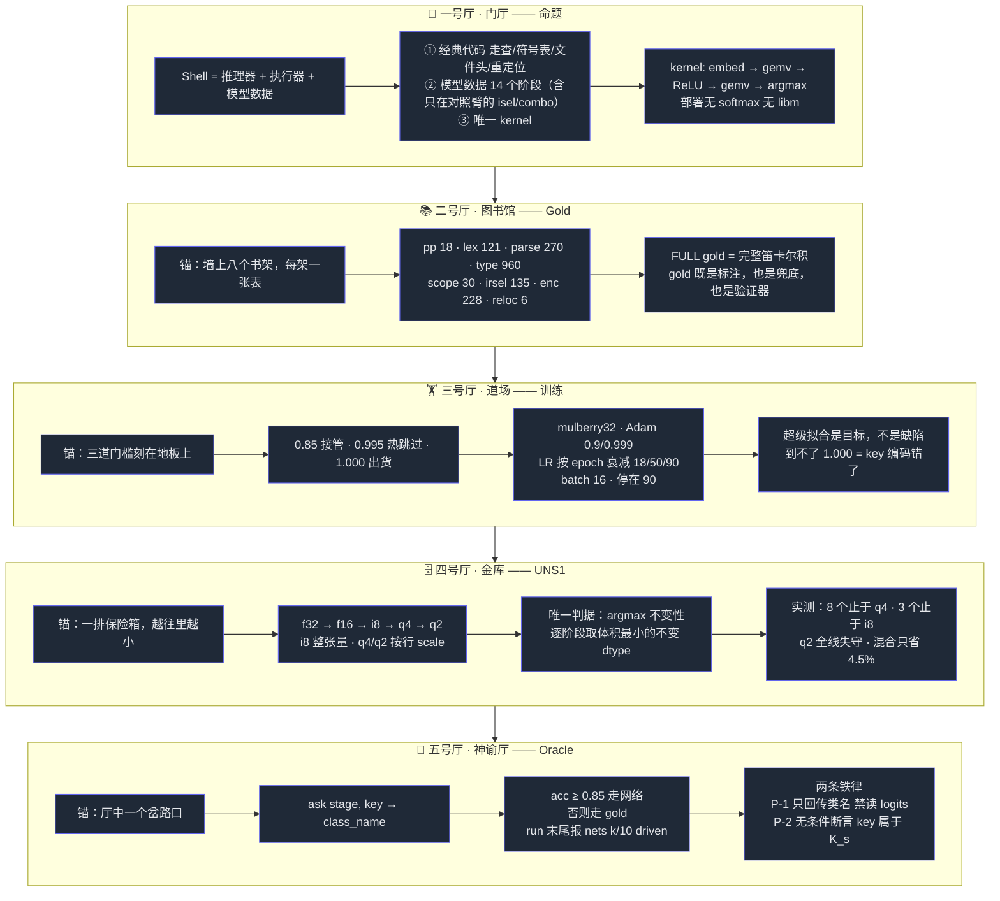
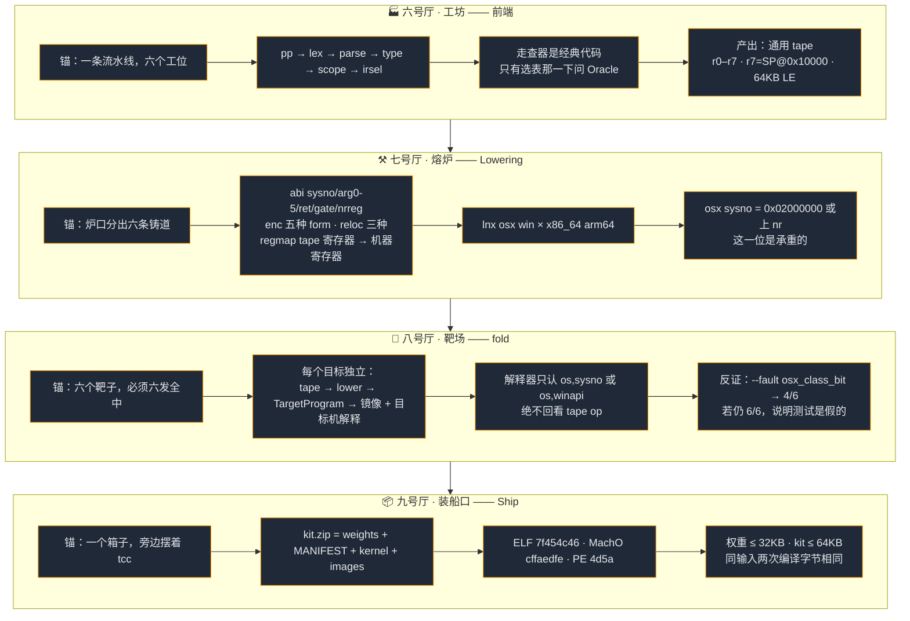
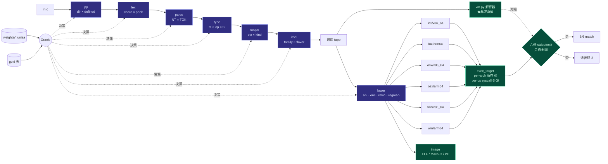
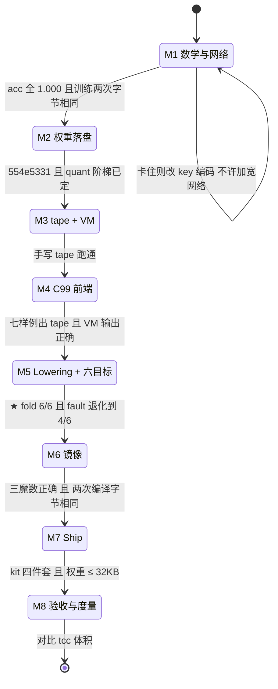
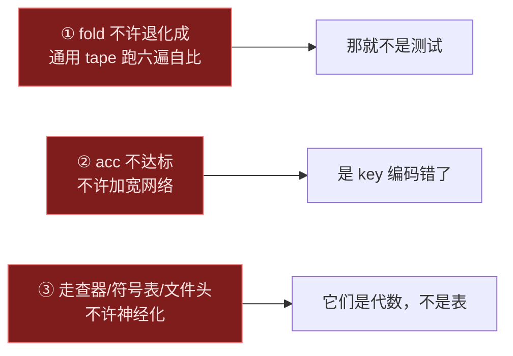

# UNISA SH —— 记忆宫殿

> 记全局用。规格正文见 [`prd.md`](prd.md)，开工清单见 [`prd.tree.md`](prd.tree.md)。
> 用法：按 **门厅 → 图书馆 → 道场 → 金库 → 神谕厅 → 工坊 → 熔炉 → 靶场 → 装船口** 的顺序走一遍，每个房间只记它的「锚」和那几个数字。走完一圈，整个系统就在脑子里了。

---

## 一、宫殿全景（九个房间）

---

## 二、管线真图（精确数据流）

**读图要点**：蓝色是**学出来的表**，绿色是**经典代码**。Oracle 是唯一把两者接起来的点；`weights` 和 `gold` 都插在 Oracle 上——这就是"换权重即换能力"和"gold 是验证器"在同一张图里的样子。

---

## 三、门禁状态机（推进顺序）

---

## 四、随身卡（最容易忘的十个数）

| 记 | 是什么 |
|---|---|
| **0.85 / 0.995 / 1.000** | 接管 / 热跳过 / 出货 三道门槛 |
| **38 = 19 + 19** | OPS = SYSOPS + MOPS，顺序写死 |
| **52 = 16+8+8+12+8** | combo 的 h0 五段分解 |
| **9 heads** | form symbol gate sysno arg0 arg1 arg2 ret tls |
| **18 / 50 / 90** | LR 衰减的三个 epoch 断点 |
| **0x02000000** | osx sysno class bit，反向对照就抽它 |
| **0x10000** | r7 初值，也是 64KB 内存上界 |
| **1/19** | type 表 illegal 行的训练下采样率 |
| **6/6 与 4/6** | 正向验收 与 反向对照 |
| **7f454c46 / cffaedfe / 4d5a** | ELF / Mach-O / PE 魔数 |
| **P-1 / P-2** | Oracle 不透明性 / key 全域性——组合等价与唯一真推理义务 |
| **14 个模型** | 每决策点一个；发布路径（`--drive built`）用 12 个，`isel` 与 `combo` 只在对照臂 |
| **21,945 θ** | 全部训练产物；默认 spec 路径 11,892 θ |
| **P-8** | 存在性已构造式证明 —— 开放的是最小性，不是可行性 |
| **q4 / i8** | 8 个阶段止于 q4，3 个止于 i8，**q2 无一幸存** |

---

## 五、三条红线（走出宫殿前默念）

