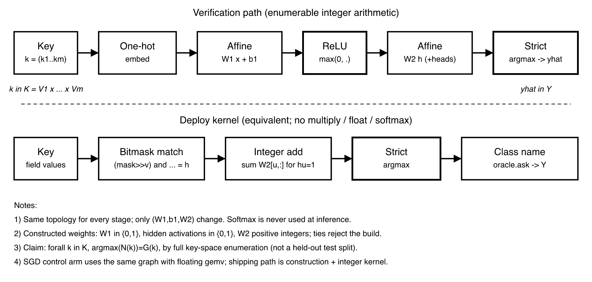

# 表即网络：以构造而非训练得到权重的自举 C 编译器

**Tables as Networks: A Self-Hosting C Compiler Whose Weights Are Constructed, Not Trained**

2026 年 9 月 · 代码、权重与全部证据：本仓库（附录 A）

---

## 摘要

编译器里的大量决策是有限函数：字符分类、产生式选择、类型提升、指令与调用约定选择、镜像字段布局。本文提出一种不经训练的神经编译方法：把每一个这样的决策写成一张在有限笛卡尔积上**处处有定义**的真值表，由表**直接构造**确定性的整数网络，再在表的全部定义域上逐键枚举，证明网络与表相等。对依赖无界结构的工作，我们把它分解为有限控制与通用存储，使有限控制的转移函数同样成为可构造、可枚举的表。

我们在 unisacc 中实现了这一方法。unisacc 是一个面向 {Linux, macOS, Windows} × {x86-64, arm64} 六个目标的 C99 子集编译器，有两个实例。其一，**决策网络实例**：18 张事实表各对应一个“one-hot → 整数仿射 → ReLU → 整数仿射 → 严格 argmax”网络，在表 1 所列 8,509 个键上精度均为 1.000，由经典的递归下降等代码在每个决策点询问；它不经 Python 在五个目标上实现了逐字节自举（N1 = N2 = N3）。其二，**网络编译器实例**：整条管线（预处理、词法、解析、优化、不可达函数剪枝、lowering、编码与镜像写出）被拆成七个字节流阶段，每个阶段是一个构造出的阈值网络，由同一个通用执行器逐步运行；模型拒绝即报错，从不回退到经典编译器。v0.0.9 的测量基线为单个 1,233,236 B 文件，携带 33 个互异网络，通过了 193 项本地门禁；v0.0.14 的发布与尚存的两条逐字节差异在 §5.5 单列。

与训练相比，构造在“多一条规则”时仍然精确，而 SGD 在合并表、扩表与多目标上系统性失败；我们给出了失败的机理。方法的代价同样真实：网络编译器比经典路线慢约 4–17 倍。枚举只证明网络等于表，不证明表符合 C 语义，这一层由外部裁判提供局部证据。

**关键词**：神经编译；权重构造；精确网络；穷举验证；有限控制；自举；可复现构建

---

## 1　引言

把神经网络用于编译器，主流有两条路。一条是端到端地学习源码到目标码的映射，它无法给出正确性保证；另一条是用学习得到的模型辅助启发式决策（寄存器分配、内联、调度），最终行为仍由手写代码兜底。两者的共同前提是：网络的权重来自训练，因此它的行为只能被统计地刻画。

本文走第三条路。我们注意到，编译器中“查表形状”的决策——给定一个离散描述，选一个离散动作——其输入可以被**设计**成一个有限笛卡尔积。在这样的定义域上，“网络是否正确”不再是泛化问题，而是一个可以被穷举判定的**模型检验问题**：只要在每一个键上运行一次部署时的推理，并与真值表比较即可。进一步，网络的权重也不必训练：任何有限全函数都有一个构造式的精确网络，而工程上的问题只剩下把它做小。

这一观察的推论比“把几张表换成网络”更强。按照计算理论的经典分解，任何确定性算法都可以写成“有限控制 + 无界存储”；有限控制的单步转移是一个有限函数，因此同样可以构造为网络，由一个与语言无关的通用执行器驱动。于是，原则上整条编译管线的控制与决策都可以由构造出的网络承担，而经典代码只剩下存储、I/O 与宿主适配。

**本文贡献如下。**

1. **方法。** 一种“表 → 构造 → 枚举”的神经编译方法：决策被表示为有限定义域上的全函数；权重由表构造而非训练；发布判据是全定义域枚举下的逐键相等（§2、§3）。
2. **从决策到管线。** 把整条编译管线表示为若干有限转移函数 δ 与一个通用执行器 E 的组合，并给出两项不改变任何答案的运行时改进：阈值前缀求值与声明式返回（§4）。
3. **实现。** unisacc：一个面向六个目标的 C99 子集编译器，同时具备决策网络实例与网络编译器实例；前者不经 Python 在五个目标上逐字节自举，后者以单个 1.23 MB 文件发布为 v0.0.9（§5）。
4. **验证纪律与经验。** 穷举枚举、逐字节差分与外部裁判的分层验证，以及把枚举用于手写纯函数时发现的、抽样无法发现的缺陷（§6、§7.4）。
5. **构造与训练的对照。** 在真实编译器表上，SGD 在合并、扩表与多目标时系统性失败；我们把原因归结为规则变化所需的离散联合跳变（§7.3）。

我们刻意**不**声称：表符合 C99 语义、整机语义保持，或网络编译器具有速度优势。这些边界在 §8 集中讨论。

## 2　问题形式化

### 2.1　有限决策与精确性

**定义 1（阶段）。** 一个阶段 $s$ 由字段 $(f_1{:}V_1,\dots,f_m{:}V_m)$、输出词表 $Y$ 与真值表 $G_s:K_s\to Y$ 组成，其中 $K_s=V_1\times\cdots\times V_m$ 为有限笛卡尔积，$G_s$ 在 $K_s$ 上处处有定义。多头阶段有多个输出词表，每个头各有一张表。

**定义 2（精确）。** 网络 $N$ 对阶段 $s$ 精确，当且仅当对每个 $k\in K_s$，$\operatorname{argmax}N(k)$ 唯一且等于 $G_s(k)$。

**定义 3（询问纪律）。** 编译器只经由不透明接口 `ask(s, k)` 使用网络：不读取 logits，不在网络拒绝时回退到真值表；每个被询问的 $k$ 都满足 $k\in K_s$，否则立即断言失败。

在询问纪律下，若每个阶段都精确，则网络驱动的编译器与真值表驱动的编译器行为相同（§3.4 的 P-5）。因为 $K_s$ 有限，精确性可以被完全判定，无需任何统计论证。

### 2.2　有限控制与通用执行

对依赖无界结构的工作，我们采用“有限控制 + 通用存储”的分解。编译过程写作

$$
\mathrm{Compile}(x)=\mathrm{dec}\bigl(\mathrm{Run}_{E,\delta}(\mathrm{enc}(x))\bigr),
$$

其中 δ 为有限控制的转移函数：输入为当前控制状态与一个**有限**观察（下一个输入字节、栈顶符号或上一动作的比较结果），输出为下一状态与一个动作序列的编号；E 为与语言无关的执行器，负责读写、栈与输出等通用动作；`enc` 与 `dec` 只做显式的表示转换。`Run` 反复观测、求 δ、执行动作，结果为接受、拒绝或发散。

这一分解依据计算理论的标准结论：确定性算法可以由有限控制、有限字母表与无界带存储实现，其单步只读取有限信息，因而单步转移是有限函数，可以按 §3.1 构造为精确网络。存在性不保证网络小或执行快；它也有明确前提：无界的常量、标识符、地址与类型结构必须编码为有限符号序列并经通用存储访问，而不能作为 δ 的一个输入值；“判断 typedef”“按 C 规则转换类型”这类语言相关工作必须展开进 δ，不能藏进 E。

### 2.3　证明档位

| 档位 | 内容 | 状态 |
|---|---|---|
| **T1** | 每个发布网络在其全部定义域（或声明观察域）上与表相等 | 已证：构造式存在性 + 全域枚举 |
| **E** | 网络编译器在已测语料上与经典参考逐字节对拍；v0.0.14 仍有两条具名差异 | 经验证据，范围见 §5.5 |
| **T2** | 网络编译器的全过程模拟参考编译器 | 未证：需初态关联、状态不变量、终态匹配与发散敏感条件 |
| **T3** | 编译保持所声明源语言的可观察行为 | 未证：需先固定语言子集、ABI 与未定义行为 |

T1 是本文的定理性结论；E 是工程证据；T2 与 T3 是明确的开放义务。

## 3　权重构造

### 3.1　存在性

对键 $k=(k_1,\dots,k_m)$ 做 one-hot 嵌入，并为每个键分配一个隐藏单元 $u_k$：

$$
W_1[\mathrm{coord}(i,k_i),u_k]=1,\quad b_1[u_k]=-(m-\tfrac12),\quad W_2[u_k,G(k)]=1 .
$$

输入 $k$ 时恰有 $u_k$ 的预激活为 $\tfrac12$，其余单元都不超过 $-\tfrac12$，经 ReLU 后只有 $u_k$ 存活，argmax 即 $G(k)$。因此精确网络总存在，宽度上界为 $|K|$。这是已知结论（有限状态机的网络编码，以及 Tracr 中查表式 MLP 的构造）；我们的工作是把它做小，并用于完整的编译器。

### 3.2　最小覆盖

朴素构造在 18 张表上共需 796,490 个参数。我们把每个隐藏单元视为键空间上的一个**立方体**——对每个字段取一个值集合，未约束的字段为“不关心”——构造于是成为带优先级的集合覆盖：

```
算法 1　决策列表构造
输入：真值表 G : K → Y
1  商化：合并对标签不可区分的字段取值
2  R ← 空列表；U ← K
3  while U ≠ ∅:
4      c ← 覆盖 U 中最多“同一标签”键、且不与更早规则冲突的立方体（字段可取值集合）
5      R.append((c, 该标签))；U ← U \ c
6  删除冗余立方体；按 R 的逆序为输出权重赋正整数，使更具体的规则严格胜出
7  多头阶段：在头之间共享立方体
8  在原始（未商化的）K 上逐键枚举验证；有错或并列则拒绝
```

仅第 3–5 行的贪心覆盖就把参数量从 796,490 降到 71,828。所得网络满足：$W_1\in\lbrace 0,1\rbrace $；阈值 $b_1=-(|F|-1)$ 由立方体约束的字段数 $|F|$ 决定，无需存储；隐藏激活 $\in\lbrace 0,1\rbrace $；$W_2$ 为正整数（多数阶段不超过 16，type 阶段最大 512）。隐藏层因此退化为**布尔合取**，输出层为整数加权投票。对 5 个小表，我们在立方体表示类内求得精确最小值（35 → 20 单元）；我们不声称这等价于任意网络的最小宽度。

表 1 列出 18 个阶段的规模，由代码从真值表与构造权重自动生成。

**表 1　决策网络实例：各阶段的键空间与构造网络规模**（精度为全域枚举）

<!-- stages-zh:begin -->
| 阶段 | 键字段 × 词表大小 | 输出 | 键数 | 单元 | 精度 |
|---|---|---|---:|---:|---:|
| pp | 指令 9 × 已定义 2 | 4 | 18 | 6 | 1.000 |
| lex | 字符类 12 × 前瞻 12 | 10 | 144 | 11 | 1.000 |
| parse | 非终结符 5 × 记号 68 | 36 | 340 | 34 | 1.000 |
| type | 类型 15 × 操作 19 × 类型 15 | 16 | 4,275 | 62 | 1.000 |
| scope | 上下文 6 × 种类 5 | 7 | 30 | 9 | 1.000 |
| irsel | 族 6 × 变体 70 | 70 | 420 | 75 | 1.000 |
| enc | 操作 74 × OS 3 × 架构 2 | 5 | 444 | 5 | 1.000 |
| reloc | 种类 3 × 架构 2 | 3 | 6 | 3 | 1.000 |
| regmap | tape 寄存器 8 × 架构 2 | 16 | 16 | 10 | 1.000 |
| tyinfo | 类型 16 | 3 头 | 16 | 6 | 1.000 |
| pfconv | 转换符 9 | 7 | 9 | 7 | 1.000 |
| peep | 指令 A 8 × 指令 B 17 × 关系 12 | 10 | 1,632 | 18 | 1.000 |
| opinfo | 操作 72 | 3 头 | 72 | 16 | 1.000 |
| prec | 操作 19 | 11 | 19 | 11 | 1.000 |
| binsel | 操作 16 × sign 2 | 23 | 32 | 18 | 1.000 |
| isel | 操作 74 × 架构 2 | 2 头 | 148 | 74 | 1.000 |
| abi | 操作 74 × OS 3 × 架构 2 | 13 头 | 444 | 52 | 1.000 |
| combo | 操作 74 × OS 3 × 架构 2 | 15 头 | 444 | 100 | 1.000 |
| **合计** | | | **8,509** | **517** | |
<!-- stages-zh:end -->

### 3.3　部署内核与确定性



验证按整数 gemv 语义逐键运行：one-hot 输入、整数仿射、$\max(0,\cdot)$、整数仿射、严格 argmax。部署内核利用 $W_1$ 与隐激活的布尔性，把第一层收成阶段局部掩码的合取、第二层收成整数加法，与验证路径在定义域上逐点一致；它不含 softmax、浮点、乘法、libm 或动态内存。18 个阶段的权重合计 9,124 字节。

**阶段独立的表示公理。** 阶段 $s$ 的网络结构与数值表示由自己的有限键域、词表、输出头和取值范围确定，其他阶段不施加同形约束。构造时 `maskw(st)` 逐阶段选择掩码宽度；Q-8 逐阶段选择体积最小且保持输出不变的 dtype，并校验相应算术范围。阶段之间只约定输入输出的类别与字节接口，不共享掩码宽度、权重 dtype 或累加器宽度。其依据是精确性命题 $\forall k\in K_s:N_s(k)=G_s(k)$ 对每个 $s$ 单独判定；一个阶段的穷举通过既不要求别的阶段使用相同结构，也不证明它们的表符合 C99。

逐字节可复现依赖两点：**构造是确定的**——同一份真值表构造出逐字节相同的权重；**推理只用整数**——在内核约定的整数宽度与累加范围内，同一输入的结果唯一。二者合起来，使跨目标折叠（§6.2）与自举不动点（§5.3）成为可能；跨机器、跨编译器的一致性仍须在目标平台上验证。

### 3.4　形式化义务

| 命题 | 内容 | 由何完成 |
|---|---|---|
| **P-8** | 任意全函数 $G:K\to Y$ 有精确网络 | Lean `naive_exact`（复述已知结果） |
| **P-3** | 发布网络 ≡ 真值表 | 全域枚举；Lean `decision_list_exact` 证明算法 1 的可靠性 |
| **P-1** | 询问纪律（定义 3） | 工程纪律，作为 P-5 的前提 |
| **P-5** | 网络驱动 ≡ 真值表驱动 | Lean `cong_of_pointwise`、`p5_of_p3_trace`（在 P-1 与 P-3 下） |
| **P-2** | 每次询问的键 ∈ $K_s$ | 运行时断言；Lean 在一个玩具走查器上有样板，全走查器仍开放 |
| **P-6** | 真值表 ≡ C99 语义 | 外部裁判（§6.3）；本文不声称 |
| **P-7** | 六目标可观测行为与参考 VM 一致 | 实证折叠、故障注入与真机套件 |

刻意不做：自举不动点与六目标 ABI 的机器证明、真值表 ≡ C99 的证明，以及最少单元数的复杂度论证。

## 4　从决策到管线：网络编译器

### 4.1　划分原则：看形状，不看难度

一个决策如果是有限键到有限类的函数，就进表；如果依赖无界结构（嵌套、递归、地址算术），就交给有限控制与通用存储，但每一个决策点都必须经网络回答。常见的分工是**结构提出，表来裁决**：例如窥孔优化中，结构代码找出候选指令对并算出它们的关系（是否同槽、是否常量、是否跳到下一条、目标寄存器是否已死），做不做、做哪种改写由表回答。运算符优先级、操作分类、运算符与符号性到指令变体的映射，最初都写死在代码里，后来都迁入了表。

### 4.2　管线结构

网络编译器把编译拆成七个**字节流进、字节流出**的阶段，每个阶段是一个由声明规则构造的有限转移函数，编成整数阈值网络，由同一个通用执行器运行：

| 阶段 | 输入 → 输出 | 主要职责 |
|---|---|---|
| 预处理 | 源字节 → 预处理文本 | 续行与注释、指令、宏展开与重扫、条件表达式、包含 |
| 词法 | 预处理文本 → 带类型的记号流 | 关键字与类型词、标识符与运算符、字面量、最长匹配 |
| 解析 | 记号流 → tape | 声明与作用域、类型与转换、优先级、语句与控制、初始化、调用 |
| 优化 | tape → tape | 栈操作改寄存器传送、基本块与活跃性、窥孔融合 |
| 剪枝 | tape → tape | 在镜像与执行路线上保守地删除不可达的整个函数，保留数据；公开的 tape 输出不经过此阶段 |
| lowering | tape → 目标指令与数据 | ABI、寄存器映射、系统调用门、数据排布与重定位 |
| 编码与镜像 | 目标指令 → ELF / Mach-O / PE（或内存镜像） | 指令编码、分支布局、重定位、镜像头与段、Mach-O 签名 |

tape 是与目标无关的中间表示：8 个 64 位寄存器（其一为栈指针）与当前 `SHAPE` 清单中的 71 种操作；浮点值以 IEEE 位模式放在通用寄存器中。tape 的操作编码不绑定 ISA；目标 ABI 仍由 lowering 和宿主交互边界分别处理。

**执行器的一步。** 当前控制状态选定一个观察银行；观察值取自下一个输入字节、续接栈顶或上一动作的比较结果；网络对观察求出下一状态与动作序列编号；执行器依次执行该序列中的通用动作：前进、标记与回跳、寄存器与索引内存读写、输出、压栈与出栈、字符串驻留。执行器不含任何专门的 C、tape、指令集或镜像判定原语。

**网络形态。** 这些网络采用状态内有序阈值表示：一个观察银行中的单元按阈值排序，下一状态与动作编号由基值加上被激活单元的差分累加得到。它与 §3 的立方体网络是同一方法的两种实现：前者适合“字节流上的有限控制”，后者适合“多字段离散描述上的分类”。

### 4.3　两项不改变答案的运行时改进

剖析显示，一个只含 `#include <stdio.h>` 的程序在解析阶段走了 3.29M 步，扫描了 6.02 亿个阈值单元，其中 97% 来自同一个状态——续点返回。

**阈值前缀求值。** 同一银行内的阈值严格递增（装载器拒绝其他情形），因此被观察值激活的单元必然构成一个前缀。执行器二分查找前缀长度，只累加这些差分——同一网络、同一求和，不存任何答案表。

**声明式返回。** 栈键银行中“续点 k → k、共用同一动作序列”的行，含义是“弹栈并在栈所指的状态继续”。它依赖无界的续点栈，按 §4.1 的原则不属于有限决策。构造器因此把这些行记为声明的返回集，只为其余行构造阈值单元。网络—表检查仍逐一比较包括返回在内的每个观察（解析阶段共 1,549,292 个），与改动前完全相等。

两项改动后，编译 `fib.c` 与编译器自身源码的耗时分别从经典路线的 10.2 倍、25.0 倍降到 3.9 倍、12.8 倍（§7.2）。

### 4.4　不属于模型的部分

命令行、文件与资源适配、包的读取与校验、网络解压与装载，是经典代码。`-run` 的最后一步也不是模型：宿主预留操作系统选择的地址并交给模型，模型一次生成最终绑定的内存镜像，宿主按镜像中记录的长度校验、提交、设置权限、清指令缓存并跳入入口，不解释 C、tape 或指令。离线构造器仍负责绑定目标事实、词表与参数化模板。因此被替代的是编译阶段的**控制与决策**，而不是全部程序代码或规则信息；“运行路径改为网络”与“需要维护的语言逻辑减少”是两个需要分别检验的结论。

## 5　实现

### 5.1　两个实例

| | 决策网络实例 | 网络编译器实例 |
|---|---|---|
| 网络 | 18 张事实表，立方体网络 | 33 个互异阈值网络 |
| 谁驱动 | 经典递归下降、lowering 与镜像写出，在决策点询问网络 | 通用执行器逐步运行各阶段网络 |
| 规模 | 8,509 个键，517 个隐藏单元，权重 9,124 B | 129,944 个阈值单元，压缩后 783,938 B（v0.0.9） |
| 回退 | 无（询问纪律） | 无：模型拒绝即报错 |
| 分发 | 单个 C 源文件 | 单个 1,233,236 B 多平台可执行文件（v0.0.9） |

### 5.2　网络编译器的规模与共享

**表 2　网络编译器的逐阶段结构（v0.0.9，`osx/arm64` -O2 镜像路线，静态统计）。** 整包 33 个互异网络、1,082 条阶段路由行；数字来自[结构审计](../archive/research/r9/r9-pipeline-structure-prune.json)。

| 阶段 | 状态 | 序列 | 展开动作 | 存储动作 | 阈值单元 | 返回银行 / 键 | 原始 / 压缩 B | 全包引用行 |
|---|---:|---:|---:|---:|---:|---:|---:|---:|
| 预处理 e2 | 1,836 | 1,396 | 10,641 | 6,159 | 3,400 | 1 / 231 | 62,762 / 24,235 | 20 |
| 词法 e1 | 403 | 8,179 | 17,256 | 16,533 | 11,259 | 0 / 0 | 131,908 / 23,064 | 120 |
| 解析 e3 | 6,440 | 17,350 | 71,714 | 55,774 | 23,044 | 1 / 1,562 | 462,815 / 110,632 | 108 |
| 优化 e4 | 904 | 403 | 6,912 | 6,784 | 1,053 | 1 / 65 | 45,128 / 12,621 | 72 |
| 剪枝 prune | 322 | 166 | 1,739 | 1,707 | 297 | 1 / 13 | 11,251 / 4,132 | 144 |
| lowering | 1,572 | 809 | 15,095 | 5,537 | 937 | 1 / 447 | 39,840 / 13,454 | 24 |
| 编码与镜像 elf | 1,937 | 840 | 9,234 | 7,888 | 1,517 | 1 / 333 | 62,960 / 19,694 | 13 |

“展开动作”是展开共享前缀后各静态序列的动作数之和；“存储动作”只计记录自身的动作后缀；二者都不是运行次数。七个阶段合计 13,414 个状态、29,143 个序列、132,591 个展开动作、100,382 个存储动作、41,507 个阈值单元、6 个返回银行 / 2,651 个键，原始 816,664 B，压缩后 207,832 B。整包 33 个网络各计一次，为 56,701 个状态、81,777 个序列、456,158 个展开动作、307,529 个存储动作、129,944 个阈值单元、31 个返回银行 / 10,774 个键，原始 2,620,844 B，压缩后 783,938 B；压缩体不含包目录与记录头，共享模型不按引用行重复计字节。

词法、解析、优化、剪枝与多文件分帧网络由六个目标共享；每个目标独有两个预处理变体、一个 lowering 与一个编码网络；同一预处理变体在各目标之间只差预定义宏（在剪枝前候选上测得记录级 Jaccard 0.998–0.999），这提示了进一步的分片空间（§8）。

v0.0.9 在最终冻结源上通过 193/193 本地门禁，并有六目标 × 3 程序的烟测与 macOS 签名封装后的执行证据；各平台是原生还是仿真、Windows 自举未验等范围见[发布回执](../archive/research/r9/r9-release-acceptance.json)。

### 5.3　自举

决策网络实例的自举有三层，每层都以逐字节相等为判据：

1. **前端不动点。** 编译器把自己编成 tape：A 编自己得 B，B 编自己得 C，要求 B = C，且与另一实现（Python 前端）的结果相同。
2. **后端闭环。** 对每个探针、每个目标，C 后端写出的镜像必须与 Python 后端从同一 tape 写出的逐字节相同：94 个探针 × 6 个目标，564/564；编译器自身 6/6。
3. **无 Python 的原生自举。** 原生编译器写出自己 N1，N1 写出 N2，N2 写出 N3，要求 N1 = N2 = N3，且其余五个目标的交叉输出一致。这在 osx/arm64、lnx/arm64、lnx/x86-64、win/arm64 与 win/x86-64（后者经系统仿真）上成立，全程不调用 Python。

网络编译器在固定网络包下实现了驱动自举（macOS arm64 上 N1 = N2 = N3）；这不包含网络包本身或多平台容器的自构造。

### 5.4　0.0.10 开发证据（不替换发布基线）

本文表 2 与性能表仍以 v0.0.9 发布物为基线。另记录 R10 开发候选：宿主 ABI 载体认证阶段 `nativeabi` 从原始类型图及目标事实产生载体证书，分类在网络中，宿主只执行已声明载体的搬运与调用。自然 16 字节 union 域保留原始参数数量、对象大小与 align4/8，按目标区分整数/SSE lane 和 ARM HFA；模型为 1,332 态，343,400 个观察全域 network=table，310 个独立图 oracle 一致。两种 macOS ISA、九种布局、四种寄存器压力、双向调用的 144 个实际变体通过 ASan/UBSan 与三优化级各 100 次，共 43,200 次 native 调用、21,600 次脚本回调。系统 macOS x86_64 libffi 的混合寄存器边界反例单列保留；固定官方 3.5.2 依赖后实际调用通过，不能由网络—表相等推出该宿主 ABI 事实。根开发产物为 1,116,367 B，24 个部署网络全域核对、28 项受影响门禁通过；[候选证据](../archive/research/r10/r10-union16-candidate-evidence.json)、[公开调用](../archive/research/r10/r10-union16-qualified-public-evidence.json)、[依赖反例与交付](../archive/research/r10/r10-ffi-provider-delivery-evidence.json)。这不是 0.0.10 发布结论，也不覆盖任意 union/BANK、位域、wide-FP 或全部六平台 ABI；这些仍是开发义务。

### 5.5　v0.0.13–v0.0.14 的后续证据与未闭合项

本节是发布后的增量记录；表 2 与表 4 仍以 v0.0.9 为身份固定的历史基线，不把不同版本的网络数、字节数或速度拼成一次测量。v0.0.13 的未签名候选为 1,190,297 B，本地 361 项门禁各通过一次，六目标演示矩阵通过；v0.0.14 的未签名候选为 1,288,064 B，签后公开的 `unisacc.com` 为 1,303,840 B，SHA-256 为 `c229cebf6cd58ca018fece7f0d3cb142e3a6a52774ac7306f8d5423248b055df`。v0.0.14 的 365 项本地门禁各通过一次，六目标托管 runner 的演示矩阵通过；这些是有限测试证据，不是全域 C99 正确性证明（[v0.0.13 回执](../archive/research/r13/r13-release-acceptance.json)、[v0.0.14 回执](r14-release-acceptance.json)）。

v0.0.14 引入了 [tapebin v1](../docs/tapebin-v1.md)：目标无关的 tape 操作记录以规范二进制表示，头部另记 `origin_target`，以保留生成这份 tape 时前端所用的目标语义。71 个 opcode 的 shape 清单由 `unisa/tape.py` 生成并受 `tapebin-shape` 门禁约束；`tapebin-roundtrip` 比较结构化记录与二进制字节往返，`com-tapebin` 对同一文本 tape 比较 C 参考、Python 与产品编码器，并测试产品自身发射与读取。规范二进制字节的稳定性不等于恢复任意手写文本的空白或注释。

发布候选的 N22 自举检查分别从种子、第二代、第三代产出完全相同的**未签名**文件，三者 SHA-256 均为 `3d86639072f5d5625baa849041d1919863bf03c8bb4a2e684638ca83ce3f063a`。公司签名后的公开 `.com` 字节不同，不能与这一不动点混为一谈。C99 条款账本 [`tests/c99/clauses.tsv`](../tests/c99/clauses.tsv) 在该版按规范性子条款逐项记证据：语言 98 条中 covered 95、partial 1、unsupported 2；环境 16 条中 covered 13、partial 2、unsupported 1；库 361 条中 covered 127、partial 43、unsupported 191。`c99.sh` 的 59/59 是逐探针结果，不能替代这些条款的覆盖分母。

R14-8 的逐字节合同仍有两项具名债：`b_compound` 和 `b_pp2` 的全局复合字面量路径在 E3 与 C 参考产出不同 tape，并导致六目标镜像不同；已测程序的输出与系统 cc 一致。`exec/c/chain.knownfail` 对它们实行“转同即报错”的复活契约。因而本文只主张已列清单之外、已测输入上的逐字节对拍，并把两项差异保留为后续义务（[R14-8 记录](../archive/plans/v0.0.14.md)）。

## 6　验证方法

### 6.1　全域枚举（T1）

每个立方体网络在原始定义域的**每一个**键上按部署算术运行；只要有一个键答错或出现并列，构造即失败，拒绝发布。决策网络实例的 C 端在正常路径上查询由枚举得到的稠密表，并有显式验收命令逐一比较全部 20,190 个“键—头”问题的查表答案与直接推理结果（差异为 0）。v0.0.9 基线的 33 个转移网络逐一覆盖声明观察域，比较后继状态、动作序列与字符串；后续版本应以各自包中的网络数重新计量。

### 6.2　逐字节差分与六目标折叠

tape 被 lower 到六个目标后，每个镜像由**按该目标 ABI 解释**的机器模型执行：模型持有该架构的具名寄存器，系统调用分发器只认 lowering 产生的（操作系统，调用号），从不回看 tape。六份 (stdout, exit) 必须彼此一致，并与 tape 参考 VM 一致。为证明 6/6 不是空洞的，我们做了故障注入：去掉 macOS 系统调用号的 class 位，结果必须退化为 4/6。镜像另在本机、Linux 虚拟机与 Windows 11 虚拟机中真实运行。

**网络真的在做决策吗？** 只比较答案的测试发现不了“手写了一条与表一致的规则”。因此两个前端都报告每个阶段被询问的次数，并要求一个前端在某探针上询问过的每个阶段，另一个前端也必须询问过。这条检查抓到过一个前端只询问了三个阶段的漂移。

### 6.3　外部裁判

枚举只关闭“网络 = 表”，对“表 = C”什么也没说。我们为每个阶段登记裁判：8 个阶段有具名的外部裁判（预处理、解析、类型、ABI、优先级、类型信息、二元运算选择、printf 转换），6 个阶段只有实现间一致性，2 个阶段尚无直接裁判（作用域、指令选择前置），2 个阶段不在主编译路径上；台账为 `research/referee.tsv`。

| 外部裁判 | 覆盖与限制 |
|---|---|
| 预处理 | 与宿主 `cc -E -P` 的宏展开 token 逐一对齐（`exec/pp/macrocheck.py`、`tests/ccparity.sh`） |
| 解析 | 与宿主 `cc -Wall` 的诊断 (行, 类别) 集合双向相等（`tests/warn.sh`，探针与语料） |
| 类型 | 以宿主 cc 的 C11 `_Generic` 检查结果类型，覆盖 4,275 个键中的 1,400 个 |
| ABI | 以宿主系统调用头文件核对编号；只覆盖实际宿主的操作系统与架构 |
| 优先级 | 324 个有序运算符对：291 对在所选常量上可区分两种分组且一致，33 对不可区分 |
| 类型信息 | 11 种类型的大小，8 种整数的有无符号与窄化属性 |
| 二元运算选择 | 宿主 cc 在 64 位操作数上逐运算符比较有符号/无符号结果：16 个运算符中 7 个受符号性影响，表的无符号口味恰在这 7 个上（`tests/binsel_audit.py`） |
| printf 转换 | 宿主 printf 对 9 个转换字母的输出形状与表的例程类逐一对应（`tests/pfconv_audit.py`） |

因此准确的表述是：18/18 个阶段有网络—表的枚举证明，8/18 个阶段有覆盖范围明确的外部裁判。**测量**是第三类依据：窥孔代价表按实测修订（§7.4），但该阶段在台账中登记为实现间一致性，不计入这 6 个。

## 7　评估

我们回答四个问题：**RQ1** 方法能否支撑一个真实的编译器？**RQ2** 代价是什么？**RQ3** 构造与训练相比如何？**RQ4** 这套验证纪律能否发现传统测试发现不了的缺陷？

### 7.1　RQ1：正确性与覆盖

**表 3　决策网络实例的验收记录**

| 项目 | 判据 | 结果 |
|---|---|---|
| 阶段精度 | 全域枚举 | 18 个阶段全部 1.000 |
| 真值表对照 cc | 类型表逐键对照系统 cc | 1,400 键：一致 1,399，有意偏离 1 |
| 外部语料 c-testsuite | 输出与系统 cc 一致 | 220 个中通过 216，错误 0；4 个超出支持范围 |
| C99 探针 | 逐条与系统 cc 对拍 | 59/59 |
| 差分测试 | 与系统 cc 对拍 | 93/93 |
| 各优化级 | -O0/-O1/-O2 下与 cc -O2 输出一致 | 279/279 |
| 两前端优化一致 | 同一 tape 经两种优化器 | 190/190 |
| 真实库代码 | crypto-algorithms 等已知答案测试 | 11/11 |
| 后端闭环 | 镜像与参考后端逐字节相同 | 564/564；编译器自身 6/6 |
| 浮点格式化 | `%f/%e/%g` 与平台 libc 逐位一致 | 一致，格式化代码中无浮点运算 |

网络编译器 v0.0.9：33 个部署网络全域网络—表相等；193/193 本地门禁通过（其中包括在门禁语料上与经典参考的逐字节对拍）；六目标 × 3 程序烟测通过，其中部分目标经仿真执行，范围见[发布回执](../archive/research/r9/r9-release-acceptance.json)。

### 7.2　RQ2：代价

**尺寸。** 网络编译器的单文件产物从 5,388,402 B（v0.0.8）降到 1,233,236 B（v0.0.9，−77.1%）。缩小来自三项不改变任何网络答案的改动：网络改为二进制记录并逐网络压缩与校验；动作序列以共享前缀引用；`-run` 改为一次生成最终绑定的内存镜像。每次改动后都重新做了全域网络—表检查。

**速度。** 表 4 为同机、全新进程、五次中位数（`unisacc.c` 一行为单次）；各行所测产物见附录 A。v0.0.9 上 `calc.c` 的编译并运行为 0.177 s、最小程序启动为 0.029 s，与表中前两行（剪枝前候选）持平：剪枝在这一输入上没有测到提速（[回执](../archive/research/r9/r9-prune-product-bench.json)）。

**表 4　网络编译器相对经典参考的耗时**

| 负载 | 经典参考 | 网络编译器 | 比值 |
|---|---:|---:|---:|
| `calc.c`：编译并在内存中运行 | 0.0108 s | 0.179 s | 16.6× |
| 最小程序：启动 | 0.0032 s | 0.029 s | 9.2× |
| `fib.c`：编译到镜像 | 0.0797 s | 0.312 s | 3.9× |
| 编译器自身源码：编译到镜像 | 0.790 s | 10.15 s | 12.8× |

这是用通用执行器逐步解释有限控制的真实代价，本文不回避。主要来源已定位：`calc.c` 的 2.7 KB 源码经自动头展开后约 67 KB，其中约 96% 是内置 C 库，后续每个阶段都要处理。为此我们加入了按需保留库函数的开关：头文件中每个库函数体都有守卫，预处理阶段在由头文件派生的依赖表上求程序实际用到的名字的闭包，只保留这些函数体。在经典参考上，它使 `calc.c` 的 tape 从 268 KB 降到 132 KB、镜像从 99 KB 降到 66 KB；预处理网络实现与经典参考在 156 个文件 × 开关两态上 312/312 逐字节一致。

**与传统编译器的比较。** 表 5 为决策网络实例的一次测量（osx/arm64，三次取最小）。所有编译器执行同一任务——以 -O2 编译 unisacc 自身——并逐字节核对产物。

**表 5　决策网络实例与 tcc、cc 的比较**

| 由谁构建 unisacc | 构建耗时 | 得到的二进制 | 该二进制编译 unisacc.c | 相对 cc -O2 |
|---|---|---|---|---|
| cc -O2 | 1.81 s | 569,384 B | 0.15 s | 1.0× |
| cc -O0 | 0.15 s | 490,840 B | 0.49 s | 3.3× |
| tcc | 0.02 s | 683,008 B | 0.55 s | 3.7× |
| unisacc -O2（自己） | 0.15 s | 677,154 B | 0.81 s | 5.4× |
| unisacc -O0（自己） | 0.10 s | 1,056,930 B | 2.05 s | 13.8× |

在这一负载上，自举得到的编译器用时约为 tcc 构建版的 1.5 倍；这是单一负载的结果，不代表一般代码质量。

### 7.3　RQ3：构造与训练

我们保留了一条 SGD 对照臂：同一结构，Adam（β₁ = 0.9，β₂ = 0.999），batch 16，学习率 0.032 → 0.014 → 0.006 → 0.0025 分段下降，首次达到 1.000 即冻结。

| 情形 | SGD | 构造 |
|---|---|---|
| 单表（11 个阶段，21,925 θ） | 全部达到 1.000，18.8 s | 精确 |
| 合并相邻阶段 | 参数增至 12.8 倍（45,209 θ）仍停在 0.8143 | 精确 |
| 扩表（加入浮点类型） | 原宽度下 type 阶段降到 0.9514，须加宽 | 重建一次，3 s，精确 |
| 目标数超过 24 | 塌缩到 0.4419 | 单元数近似 $39 + 4.2\log_2(\text{targets})$ |
| 稳定性 | 99 次中 30 次先命中 1.000 又掉下来 | 确定 |

**机理。** 在立方体表示下，一条规则的改变需要在 $(W_1,b_1)$ 上做一次**联合的离散跳变**：加入或移除一个字段约束，同时改变阈值。沿 $W_1$ 的小步梯度只会把单元关掉，却无法协调地完成这一跳变（我们称之为活板门现象）。因此 SGD 天生不擅长“再多一条规则”，而构造本来就是按规则逐条展开的。这与“精确解存在但梯度方法不可达”的已知定理家族一致（§9），我们的贡献是真实编译器表上的实例与机理。

量化方面，混合精度只节省 4.5%，2 比特量化在所有阶段都失败。

### 7.4　RQ4：验证纪律发现了什么

**真值表本身会错。** 类型表里曾有一条错规则：`int + int` 的结果类型写成了 `long`。它在整个项目期间都存在——枚举 1.000、全部套件通过——因为求值恰好在 64 位里进行，打印出来的数字没有错；它只在 `sizeof` 与符号性上露出来，而没有探针去问。外部裁判首跑即发现 200 个键有误（与此同源），在真值表中改正并重建权重即可。**枚举保证网络精确地复制了表；如果表错了，它也精确地复制了错误。** 因此表的每一格都应有一个外部裁判。

**代价表的裁判是测量。** 窥孔表中“乘以 2 的幂改为移位”在语义上完全正确，却让 x86 镜像大了 24 KB（tape 的移位在 x86 上要经过 `cl` 寄存器）。于是这一格改为保留乘法——决策在表里，量了就改表，而不是改代码。窥孔表整体使出货编译器的 arm64 镜像缩小 29%，自编译相对 cc -O2 从约 11 倍降到 4.0 倍。

**把枚举用回手写代码。** “枚举整个定义域”的纪律同样适用于手写部分，条件是被测对象为纯函数且有独立实现可作差分。数据布局函数（非零块在前、全零块在后，各自保持地址 mod 8）满足这两个条件。我们枚举了所有长度不超过 3 的数据定义序列（字母表取 6 种代表性的块），外加“同一符号定义两次”的变体，共 762 条 tape × 6 个目标 = 4,572 次镜像逐字节比对，12 秒完成。

它立刻发现两个实现的语义分歧：同名符号定义两次时，一方驻留（不再分配），另一方重新分配并移动符号，镜像相差 8 字节。抽样为什么没发现它？触发条件是“声明顺序 ≠ 地址顺序”，这在小程序里几乎不会自然出现：90 个探针、220 个外部语料程序、540/540 的逐字节闭环全部通过。唯一自然长出这种形状的输入是编译器自己——707 KB、1,874 个数据符号，第 282 个符号处顺序开始回退——它让六个目标**全部段错误**。

**逐字节判据暴露“解释器看不见”的错误。** 多级指针高 32 位被截断、静态局部变量未保留、某平台 argc 读错位置、镜像把 87 MB 的零写进文件（修正后编译器自身镜像从 91 MB 降到 639 KB）——这些都是在原生运行自己编出的程序时才暴露的。

两条可迁移的经验：构造—枚举不只是训练的替代品，而是一种可以贯穿整个实现的验证纪律；“逐字节相同”远强于“输出相同”，它不给实现留任何自由度，而差分对照让它在没有形式规范时依然可检。

## 8　讨论与局限

**表的正确性。** 本文最重要的边界：枚举证明网络等于表，不证明表等于 C。登记表中 8/18 个决策阶段有具名外部裁判，但每个只覆盖注明的键或行为；v0.0.9 基线的 33 个转移网络对 C 语义的证据来自与经典参考的逐字节对拍，而经典参考本身又只由有限语料检验。v0.0.14 仍有两条具名的前端逐字节差异（§5.5），不能把有限语料上的一致写成全域等价。

**速度。** 表 4 的历史测量中，网络编译器慢 4–17 倍；它不是 v0.0.14 的同身份速度结论。不可达函数剪枝已进入 v0.0.9，但在 `calc.c` 上未测到提速；后续按需保留库函数与网络分片也须单独测量，通用执行器逐步解释的成本不会消失。

**语言与产品范围。** 支持 C99 子集与自带头文件；多文件合成为单一程序，没有系统目标文件链接器，不兼容常规的 `.o` 流程。网络只在枚举过的定义域上有定义——这是设计而非缺陷：扩展语言即扩表后重建。

**表示与维护成本。** 把控制流编成表，并不自动减少需要维护的语言逻辑：离线构造器仍承载规则的编排，机器码字节模板仍是代码。是否真正减少维护面，需要在相同覆盖下统计声明规则、专用生成逻辑与仍在使用的旧实现，而不能由文件类型判断。

**容量。** 编译器使用静态上限，自身源码曾用到源码缓冲区的 99.4%。上限已放宽，并在自身用量超过任一上限一半时报警；设计目标是编译器自身规模的约两倍。

**有效性威胁。** 性能数字来自单机，部分平台经仿真执行；速度表各行来自不同的产物版本（附录 A）；c-testsuite 与探针语料的覆盖不能外推到任意 C99 程序。

**开放问题的去向。** T2、T3、全走查器 P-2、外部裁判覆盖、速度、维护面、网络包自构造、模板进表、容量与 `.o` 流程，已逐项登记为 [v0.1.0 计划](../prd.md) 的交付，各自带验收标准；完成一项，即从本节移到结果一节。

## 9　相关工作

**有限自动机与程序的网络编码。** 把有限状态机精确编码进循环网络可追溯到 Omlin 与 Giles（1996）；Siegelmann 与 Sontag（1995）证明了有理权重循环网络的图灵完备性，为“有限控制 + 存储”的神经化提供了理论先例。RASP（Weiss 等，2021）与 Tracr（Lindner 等，2023）把程序编译为 Transformer 权重，其查表式 MLP 构造即本文 §3.1 复述的存在性。与这些工作相比，本文把构造落到一个完整、能自举、面向六个真实目标的编译器上，把网络规模作为工程问题系统地缩小，并以全定义域枚举作为发布判据。

**表驱动的编译器。** 编译器使用表由来已久：LALR 解析器生成器（Johnson，1975）输出解析表；Graham 与 Glanville（1978）用表驱动代码生成；BURS 与 iburg（Fraser、Hanson 与 Proebsting，1992）以树模式表完成指令选择。本文与它们的区别不在“用表”，而在于把表**编译为网络并以网络作为唯一的决策执行者**，同时把整条管线（而不只是解析或指令选择）的控制表示为可构造、可枚举的有限转移。

**学习型编译与神经程序执行。** 端到端的神经翻译与学习型启发式（如 MLGO 类工作）以训练得到权重，其行为只能被统计刻画；神经图灵机（Graves 等，2014）学习读写存储的控制器。本文的控制器由构造得到，行为可被完全判定。

**验证编译器与可信构建。** CompCert（Leroy，2009）与 CakeML（Kumar 等，2014）证明了整机语义保持，这是本文明确不声称的 T3。Wheeler（2009）的多样化双重编译以逐字节比较对抗“信任的信任”攻击；本文的自举不动点与多实现逐字节闭环在精神上与之一致。

**梯度方法的不可达性。** Shalev-Shwartz、Shamir 与 Shammah（2017），Shamir（2018），Malach 与 Shalev-Shwartz（2020），Barak 等（2022）给出了梯度方法在若干离散目标上的失败形态。本文 §7.3 提供了真实编译器表上的实例与机理。

## 10　结论

对编译器中查表形状的决策，“精确”是一个可以被穷举判定的性质，权重也可以由表直接构造而不必训练。沿着“有限控制 + 通用存储”的分解，这一方法从单个决策推广到整条编译管线：unisacc 以构造出的网络承担编译阶段的控制与决策，面向六个目标，并能自举；与参考实现的逐字节关系由具名门禁约束，v0.0.14 仍有两条已登记的差异。它的代价同样清楚：表 4 的历史测量显示明显速度成本，表本身的正确性仍需外部裁判。我们认为，“构造 + 枚举 + 逐字节差分”作为一种验证纪律，其价值不限于神经网络：它同样能在手写代码中找到抽样测试找不到的缺陷。

---

## 附录 A　制品与证据

| 身份 | 内容 |
|---|---|
| v0.0.7 | 决策网络实例的最后发布，提交 `f301df3`，1,254,432 B，SHA-256 `00d25edb8cf35fce7ec3be5dcf50afd2af0d658b9a1e19abac615c94e3816bf0` |
| S-17 冻结候选 | 网络编译器的首个冻结候选，6,279,167 B，SHA-256 `9a0ae470718ea4db28a59ea838344004c741ea0119c771c1370454209bdecd46`；§4.3 的改前数字属于它（[证据](../archive/research/20260928/s17-final-evidence.json)） |
| v0.0.8 | 提交 `10672e3`，5,388,402 B，SHA-256 `948232f00028170d2090983375fbca2a3829ef8f73235baada5deb9db174d737`，未签名发布 |
| v0.0.9 | 发布 `a606ff4`，`unisacc.com` 1,233,236 B，SHA-256 `d4f7d3022a373fb71ad46dde23c72fe450beefad045727122383c85da17c678b`；193/193 本地门禁；表 2（[结构审计](../archive/research/r9/r9-pipeline-structure-prune.json)）|
| v0.0.10 | 冻结源 `fdff9c5`，`unisacc.com` 1,152,711 B（较 v0.0.9 −6.5%），SHA-256 `4ba24140a1307a34216efd0f2e7c892a92990ee2729a8774a58e0a4fe2315002`；24 个部署网络全域网络—表相等；进程内库 libunisacc 与跨来源 typed 导入（USLCALL3 别名）；本地门禁与平台/签名范围见 [发布回执](../archive/research/r10/r10-release-acceptance.json) |
| v0.0.13 | 未签名候选 1,190,297 B、SHA-256 前缀 `94ea9c76`；361 项本地门禁各通过一次，六个 runner 的演示矩阵通过；口径与平台范围见 [发布回执](../archive/research/r13/r13-release-acceptance.json) |
| v0.0.14 | 未签名候选 1,288,064 B、SHA-256 前缀 `3d866390`；公开签名 `.com` 1,303,840 B、SHA-256 `c229cebf6cd58ca018fece7f0d3cb142e3a6a52774ac7306f8d5423248b055df`；365 项本地门禁各通过一次，六个 runner 的演示矩阵通过，种子、第二代与第三代的未签名字节相同；范围见 [发布回执](r14-release-acceptance.json) |
| 历史候选 | 剪枝前候选 `d61d0153…` 与 `7608a31b…` 的结构与门禁记录见 [`archive/paper-a-history.md`](../archive/paper-a-history.md) |

**数据来源。** 表 4 前两行：[基准](../archive/research/r9/r9-current-bench-20260928.json)（剪枝前候选 `c4993fd0…`）；后两行：两项运行时改进之后的产物 `c94cf5fe…`。按需保留库函数的验收：[账本](../archive/research/r9/r9-e2-libneed-acceptance-20260928.json)。尺寸改动：[压缩](../archive/research/20260928/compression-integrated-bench-20260928.json)、[单次内存镜像](../archive/research/20260928/memory-once-integrated-bench-20260928.json)。外部裁判登记：[referee.tsv](referee.tsv)。形式化：[formalization-roadmap.md](formalization-roadmap.md)、`research/lean/`。文献细目：`prior-art.md`。

**复现。** 构造与验证决策网络实例需要 Python 3.11+ 标准库与系统 C 编译器；使用已构建的编译器、原生自举与网络编译器均不需要 Python，也不需要 GPU。仓库规则要求每个执行步骤不超过 60 秒，长套件分批运行。

```bash
python3 -m unisa build-weights                  # 由真值表构造全部网络并枚举验证
python3 -m unisa acc                            # 表 1：全域精度
python3 -m unisa run examples/hello.c --fold    # 六目标折叠，期望 6/6
./tests/closure.sh examples/*.c tests/c/*.c     # 镜像逐字节闭环
./tests/nativeboot.sh                           # N1 = N2 = N3，无 Python
./tests/gate.sh --list --com                    # 列出全部门禁，再按 --suite 分批执行
TCC=<tcc 构建目录> ./tests/bench_vs.sh           # 表 5
```

网络编译器的构造与验收入口见 [`exec/c/BUILDING.md`](../exec/c/BUILDING.md)。同一方法在 JavaScript 与 WebAssembly 上的迁移见伴生文 Paper B（[`ujs-paper.md`](ujs-paper.md)）。
