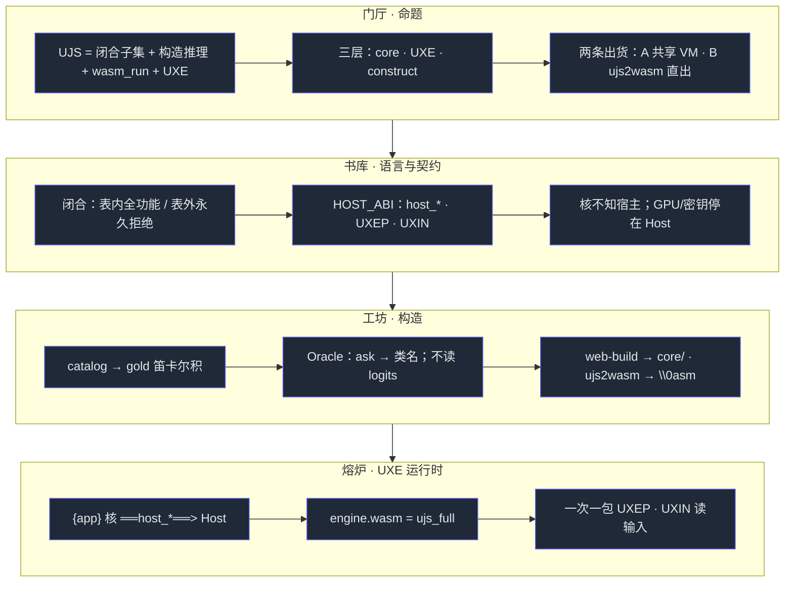
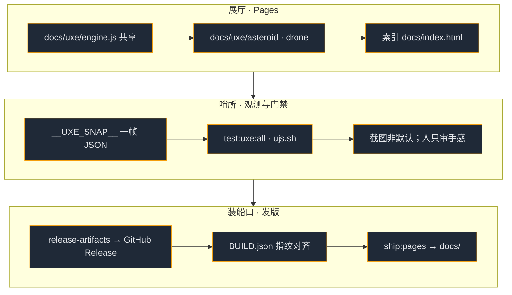
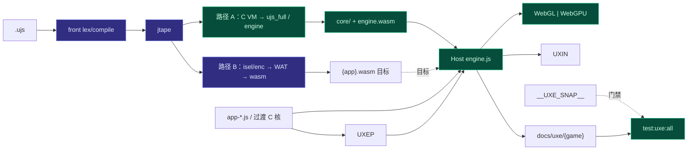
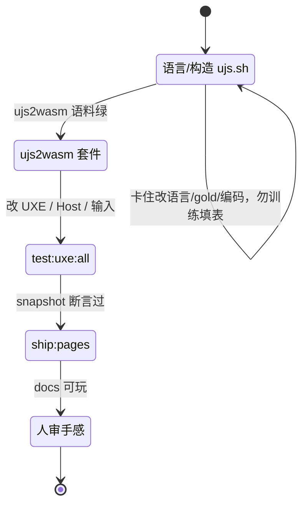
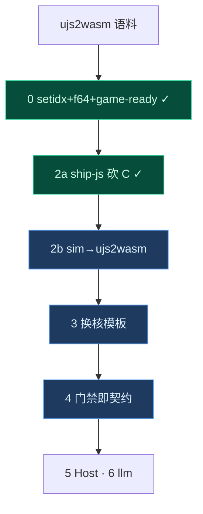
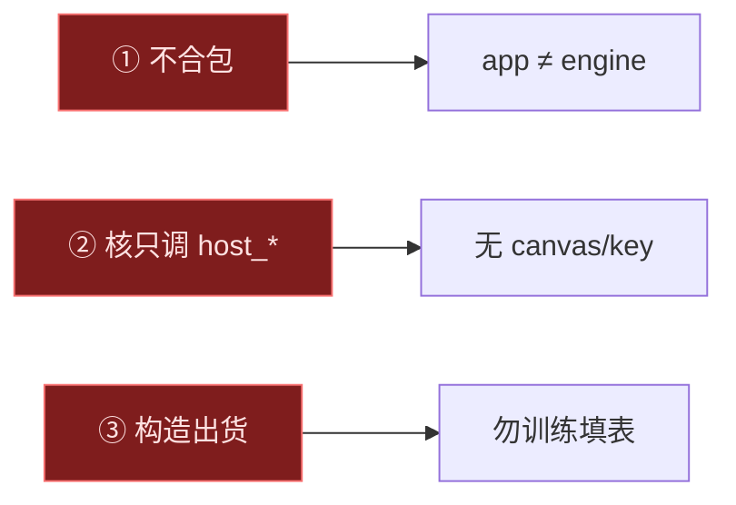

# UJS —— 产品规格 v1.3

> **唯一耦合活文档**（规格 · 目标 · 思维树 · 记忆宫殿）。与代码同会话更新。  
> Host 契约真源：[`uxe/HOST_ABI.md`](uxe/HOST_ABI.md) · 开箱：[`README.md`](README.md)  
> 归档：[`archive/`](archive/)（旧条款 / 旧路线 / 旧地图）

---

## 0. 一句话

**UJS** = 尽量贴 ES 表面的**闭合**脚本子集 + **构造法确定性推理**（gold → IntNet，不训练填表）+ 产品 API `wasm_run` + **UXE**（Host ABI · 双 wasm · Pages）。  
验收：门禁与可机读 snapshot；不以截图猜 UI。

| 层 | 交付 | 不是 |
|---|---|---|
| **core** | `bootRuntime` / `wasm_run` / `compile` · `ujs_full.wasm` | 页内训练 · 完整 ES |
| **UXE** | Host + `{app}` 核 + `engine.wasm` + 共享 `engine.js` | Three 移植 · 合包 |
| **构造** | `construct/` gold → 权重；`ujs2wasm` → `\0asm`；`web-build` → `core/` | 应用运行时依赖 |

**路径 A**（共享 VM）：`web-build` → `ujs_full.wasm` ≡ UXE **`engine.wasm`**（已交付；内核仍 C+zig）。  
**路径 B**（直出）：`python3 -m ujs ujs2wasm foo.ujs -o foo.wasm`（已交付；`isel`/`enc`→WAT→wasm）。  
开发可先 B 写 `.ujs`，再把 UXE `{app}` 接到 B（§目标）。

**语言（闭合）**：表内全功能，表外永久拒绝。有字面量 / list·dict / let·const / if·while·for·switch / function·箭头 / rest·spread / 算术比较 / 索引成员 / `len`·`keys` / 只读外层闭包。无 `undefined` 双轨、`var`/hoisting、`this`/`class`/prototype、`eval`、async/generator、RegExp 字面量。条款全表见 [`archive/prd-v1.0.md`](archive/prd-v1.0.md)。

**不交付**：完整 ES · Three-in-wasm · 合包 · 用户 LLM key 进核/packet · UJS 直播主线。

---

## 目标（按杠杆）

别人能按模板交 `{app}`，外网可玩，验收无人。**主线夯 0–4；门禁先于功能。** 不开新门面游戏。

```
0 emit 齐（setidx·f64·…）     ⟦ujs2wasm.sh + game-ready⟧     ✓
        ↓
2a ship-js 砍 C 核             ⟦uxe_ship_js.sh · 无 asteroid.wasm⟧  ✓
        ↓
2b sim 接 ujs2wasm（替 wasm_run） ⟦步进 fold · uxe 门禁⟧
        ↓
3 换核模板                      ⟦可抄路径（见下）⟧
        ↓
4 门禁即契约                    ⟦改 ABI/emit/ship → 必挂套件⟧
        ╌╌（有玩法卡住再开）╌╌
5 Host 加厚 · 6 host_llm

（原 #1 eng ABI 下沉：ship-js 已消灭 eng_* 出货路径；遗留 C 仅归档，不再投入。）
```

| # | 做什么 | 完成判据 / 测试 | 状态 |
|---|---|---|---|
| **0** | `emit_wasm`：`setidx` · `f64` · game-ready | `./tests/ujs2wasm.sh` | ✓ |
| **2a** | Asteroid ship-js（砍 `uxe_*.c` 出货） | `./tests/uxe_ship_js.sh` · `npm run ship:engine` | ✓ |
| **2b** | 玩法步进改走 `ujs2wasm` 模块（替路径 A `wasm_run`） | 步进 fold + `test:uxe:all` | 下一刀 |
| **3** | 换核模板 | 按下表抄路径绿 | 骨架 ✓ |
| **4** | 门禁即契约 | `ujs.sh` 含 ujs2wasm；ship-js 合同；uxe 无人 | 进行中 |
| **5–6** | Host / llm | 有玩法再开 | 搁置 |

### 换核模板（#3 可抄）

```
1. 写 ujs/web/game/{name}.ujs          # 只算状态，不画
2. 写 ujs/uxe/app-{name}.js            # 只调 host_* · wasm_run/预编译
3. 写 ujs/uxe/ship/{name}-host-entry.js + build-{name}-pages.mjs
4. package.json 加 ship:{name}；scripts/ship-pages.sh 挂上
5. ./tests/uxe_ship_js.sh 扩展检查 · npm run test:uxe:all
```

对照实现：`asteroid-host-entry.js` · `build-asteroid-pages.mjs` · `drone-host-entry.js` · `build-drone-pages.mjs`。

**已交付**：Host ABI v0 · UXEP/UXIN · WebGL/WebGPU · Pages（Asteroid+无人机 ship-js）· `test:uxe:all` · H1–H3 · snapshot · **ujs2wasm 直出（setidx/f64 + game-ready）** · 双 ship-js 无 C 游戏核。

**门禁（必绿）**

| 门 | 命令 |
|---|---|
| 语言 / 构造 / **ujs2wasm** | `./tests/ujs.sh`（含 `ujs2wasm.sh`） |
| **ship-js 合同** | `./tests/uxe_ship_js.sh` |
| UXE 无人 | `cd ujs && npm run test:uxe:all` |
| Pages | `npm run ship:pages` 后抽玩感 |

**工具（摘）**：`python3 -m ujs web-build` · `ujs2wasm` · `./ujs/scripts/release-artifacts.sh` · `ship-pages.sh` · `uxe-gate.sh`。  
指纹：`core/BUILD.json`。二进制走 GitHub Release，不进主树。

**代理观测**：断言写在数上。`__UXE__` · `__UXE_HOST__` · `host_debug_snapshot` / `__UXE_SNAP__` · `test:uxe:snap`。

---

# 一、思维树（markdown-tree-dag）

> 开工用。约定：`├─` 包含（树），`══>` 跨树依赖（DAG），`⟦门禁⟧` 检查点。

## T1. 系统树 —— 三层切分

任何一行代码必须能归到其中一类，归不了就是走偏。

```
UJS
│
├─ ① 经典代码（algebra）—— 绝不「训练填表」
│   ├─ 前端走查          construct/front/{lex,compile}
│   ├─ jtape / VM        jtape.py · vm.py · bc_vm.py
│   ├─ UXE Host 胶水     host-browser · packet · input · renderer-*
│   ├─ C VM               native/ujs_vm.c（路径 A）；uxe_asteroid.c 遗留不出货
│   └─ 页壳 / ship-js     demo/ · ship/{asteroid,drone} · engine.js
│
├─ ② 模型数据（constructed tables）—— 离散 key → 类
│   ├─ gold 表           catalog → gold 笛卡尔积
│   ├─ IntNet 权重       构造代数（非 SGD 出货）
│   └─ isel / enc …     ujs2wasm 决策表（WAT 形态）
│
└─ ③ 出货面（artifacts）
    ├─ core/ujs_full.wasm (+ compiler.gen.js)   路径 A
    ├─ engine.wasm                              = A 的 UXE 名
    ├─ *.wasm from ujs2wasm                     路径 B
    └─ docs/uxe/{engine.js,{game}/}             Pages
```

**DAG 边**

```
gold ══构造══> 权重 / isel·enc
② ══驱动══> ① 走查 / emit（Oracle 只回类名）
① ══产出══> ③ 出货面
A (engine) ══Host══> {app}     双 wasm，永不合包
B (ujs2wasm) ══目标══> {app}.wasm   ← 目标 #2
```

## T2. 目录树 —— 文件到职责

```
ujs/
├─ package.json          npm scripts 真源（demo / ship / test:uxe）
├─ prd.md                ★本文件
├─ README.md             开箱
├─ core/                 产品 API
│   ├─ wasm_run.js       bootRuntime · wasm_run · compile
│   ├─ ujs_full.wasm     交付 VM
│   └─ BUILD.json        指纹
├─ construct/            构造侧（非应用依赖）
│   ├─ catalog.py · gold.py · oracle.py
│   ├─ front/            lex · compile
│   ├─ ujs2wasm.py · emit_wasm.py · lower_wasm.py
│   ├─ jtape.py · vm.py · bc_*.py
│   └─ cli.py            web-build / ujs2wasm / acc / …
├─ uxe/                  UXE 嵌入
│   ├─ HOST_ABI.md       ★Host 契约真源
│   ├─ host-browser.js · packet.js · input.js · meshes.js
│   ├─ app-asteroid.js · app-drone.js
│   ├─ demo/ · ship/     源码测 · 发布对照
│   └─ archive/          下架实践车（大富翁…）
├─ native/               C：ujs_vm · uxe_asteroid（过渡）
├─ web/                  playground · Three 对照（非产品主线）
├─ scripts/              release-artifacts · ship-pages · uxe-gate
└─ archive/              旧规格 / 旧地图 / 旧路线
```

**易错 DAG**

```
web-build ══> core/ujs_full.wasm ══拷贝名══> engine.wasm
{app} ══只调══> host_*          （不知 canvas / fetch / key）
UXEP ══一次一包══> host_gpu_submit
UXIN ══> host_input_read
tests/ujs.sh ══含══> tests/ujs2wasm.sh
```

## T3. 出货 DAG —— 两条路径

```
.ujs 源
 │
 ├──── 路径 A（共享 VM）────────────────────────────┐
 │    construct front → bytecode → zig/C → ujs_full │
 │    UXE：engine.wasm + 页内 compile 或 embed      │
 │    ⟦门禁⟧ ./tests/ujs.sh · test:uxe:all          │
 │                                                  │
 └──── 路径 B（直出程序）───────────────────────────┤
      jtape → isel/enc → WAT → wat2wasm → foo.wasm  │
      ⟦门禁⟧ ./tests/ujs2wasm.sh                    │
      目标：接成 {app}.wasm，砍 uxe_*.c              │
                                                    ▼
                              npm run ship:pages → docs/
                              ⟦门禁⟧ test:uxe:all · 人审手感
```

## T4. UXE 积木树

```
UXE Shell
├─ {app|game} 核     调度 · 组 UXEP · 读 UXIN · 只调 host_*
├─ engine.wasm       UJS VM（= ujs_full）；eng_* 待下沉（目标 #1）
├─ Host（engine.js） GPU / 输入 / 时间 / 资源 /（规划）llm
└─ Pages             docs/uxe/engine.js + docs/uxe/{name}/
```

```
demo：*.ujs → compile(ujs_full) → host_*
ship：index.html → engine.js + game.js + engine.wasm [+ app.wasm]
```

## T5. 验收 DAG

```
语言绿 ── ./tests/ujs.sh ──┬── acc / fold / icfold / difftest
                           ├── front parity · in-page wasm_run
                           └── ujs2wasm（direct · fold · neg · tinyvm?）

UXE 绿 ── test:uxe:all ────┬── CDP 探针 · snapshot 数
                           └── 禁代理猜 UI

出货 ──── ship:pages ─────── docs/ 与 BUILD 指纹对齐 Release
```

## T6. 三条红线

```
① 双 wasm 永不合包                    → {app} ≠ engine
② 核只调 host_*                       → 无 canvas / key / fetch
③ 出货权重构造、不训练填表             → --drive 默认 built；勿擅跑 train
```

---

# 二、记忆宫殿（mermaid-flowchart-memory-palace）

> 记全局用。按 **门厅 → 书库 → 工坊 → 熔炉 → 展厅 → 哨所 → 装船口** 走一圈。

## 宫殿全景





## 管线真图



**读图**：紫 = 构造/决策表路径；绿 = 经典运行时与 Host。`{app}` 接路径 B 是当前主杠杆。

## 门禁状态机



## 目标推进图



## 随身卡

| 记 | 是什么 |
|---|---|
| **A / B** | 共享 VM（engine） / ujs2wasm 直出 |
| **双 wasm** | `{app}` ≠ `engine`，永不合包 |
| **host_*** | 核唯一出入口；GPU/key 停 Host |
| **UXEP / UXIN** | 一次一包提交 / 输入快照 |
| **ujs.sh · test:uxe:all** | 语言门 · UXE 无人门 |
| **BUILD.json** | 与 Release 对指纹 |
| **构造不训练** | 出货权重由 gold 代数生成 |
| **1→4** | emit → ship-js → ujs2wasm 步进 → 模板/门禁 |


## 走出宫殿前默念



---

## 文档角色（收束后）

| 文档 | 角色 |
|---|---|
| **本文件** | 规格 · 目标 · 思维树 · 记忆宫殿 |
| [`uxe/HOST_ABI.md`](uxe/HOST_ABI.md) | Host 符号 / UXEP·UXIN / LLM 规划 |
| [`README.md`](README.md) | 开箱与分发 |
| 各层薄 README | 目录文件表（`core/` · `construct/` · `native/` · `web/` · `uxe/`） |
| [`archive/`](archive/) | 历史；不当真源 |

升版：破坏性语言/API → bump；旧活规格摘入 `archive/`。
