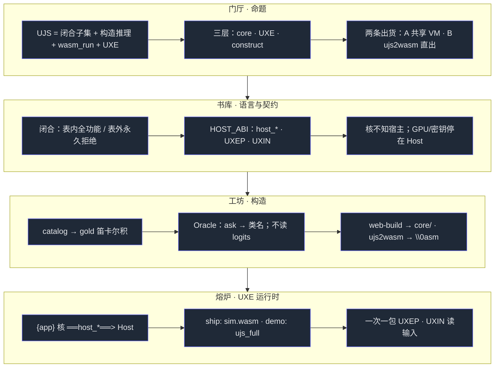
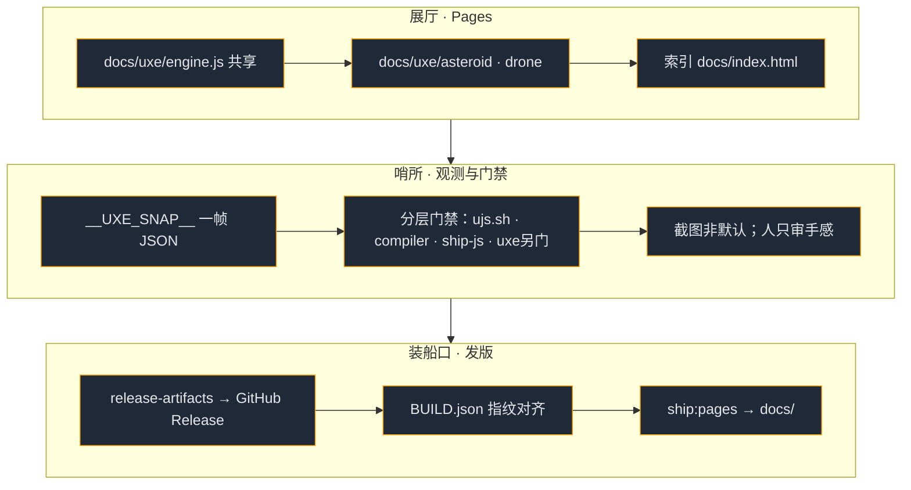
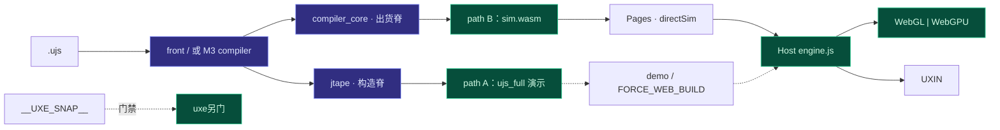
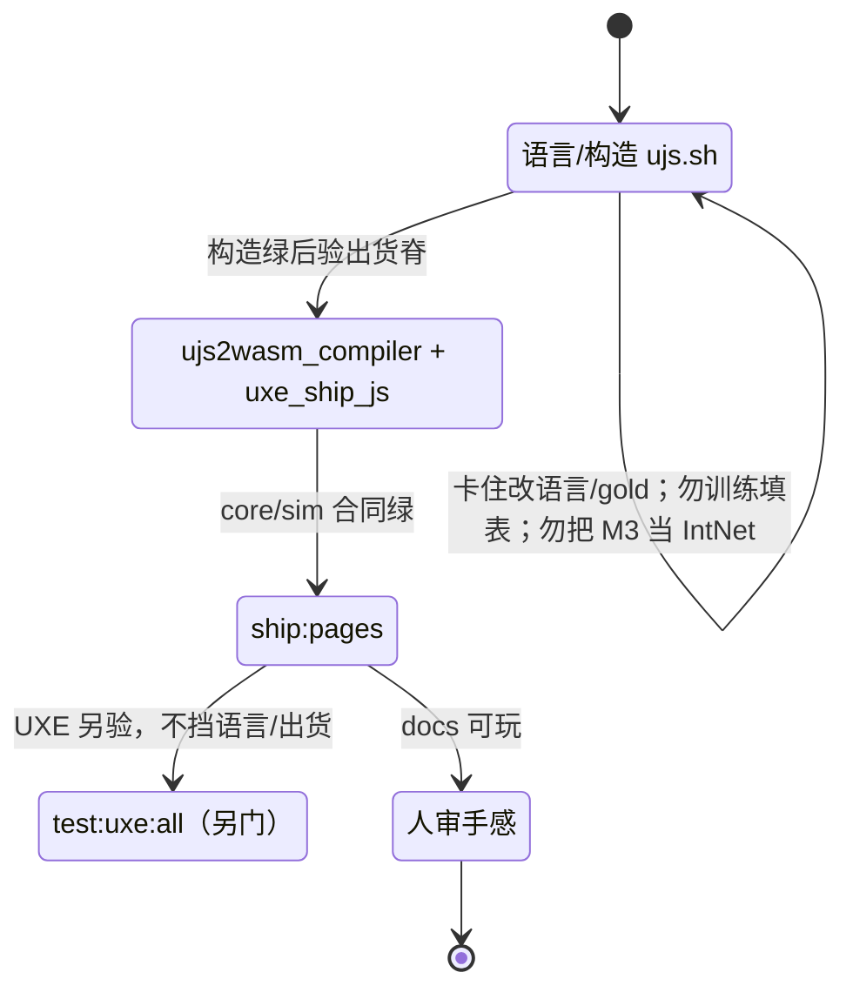
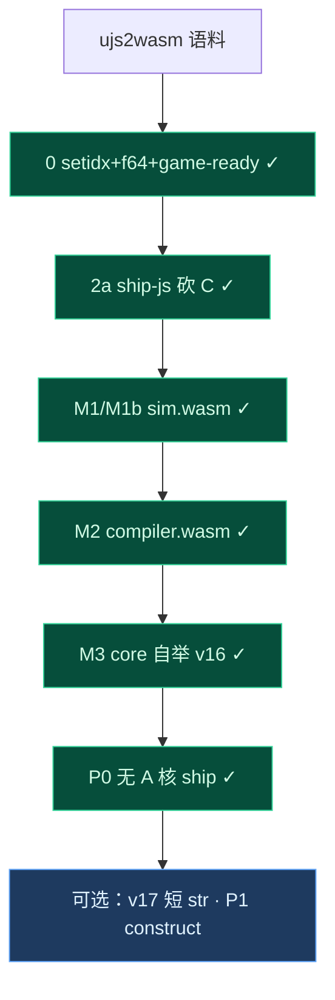
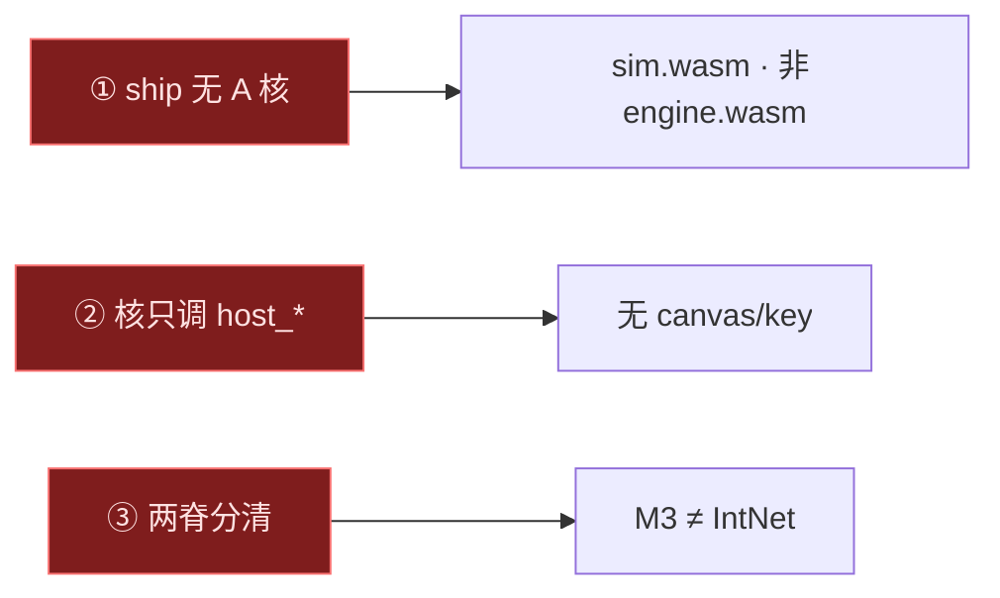

# UJS —— 产品规格 v1.3

> **唯一耦合活文档**（规格 · 目标 · 思维树 · 记忆宫殿）。与代码同会话更新。  
> **目录板块**：[`ARCHITECTURE.md`](ARCHITECTURE.md)（种子 · 权重 · 自迭代 · 实践）  
> Host 契约真源：[`uxe/HOST_ABI.md`](uxe/HOST_ABI.md) · 开箱：[`README.md`](README.md)  
> 归档：[`archive/`](archive/)（旧条款 / 旧路线 / 旧地图）

---

## 0. 一句话

**UJS** = 尽量贴 ES 表面的**闭合**脚本子集 + **构造法确定性推理**（gold → IntNet，不训练填表）+ 产品 API `wasm_run` + **UXE**（Host ABI · 双 wasm · Pages）。  
验收：门禁与可机读 snapshot；不以截图猜 UI。

| 层 | 交付 | 不是 |
|---|---|---|
| **core** | `bootRuntime` / `wasm_run` / `compile` · path-A `ujs_full` · **出货** `compiler_core` | 页内训练 · 完整 ES · 把 M3 说成 IntNet |
| **UXE** | Host + `{app}` · Pages 步进 **`sim.wasm`** · 共享 `engine.js` | Three 移植 · 合包 · ship 必经 `engine.wasm`（P0 已弃） |
| **构造** | `construct/` gold → 权重；全表 `ujs2wasm`；`web-build` → path-A | 应用运行时依赖 · ship emit |

**路径 A**（共享 VM · 方法/演示）：`web-build` → `ujs_full.wasm`（曾用名 **`engine.wasm`**；**非** P0 ship 必经；内核仍 C+zig）。  
**路径 B**（直出 · 出货步进）：`compile.mjs` → **`compiler_core.wasm`** → `sim.wasm`（已交付；玩法核）。  
开发可先 B 写 `.ujs`，再把 UXE `{app}` 接到 B（§目标）。

**语言（闭合）**：表内全功能，表外永久拒绝。有字面量 / list·dict / let·const / if·while·for·switch / function·箭头 / rest·spread / 算术比较 / 索引成员 / `len`·`keys` / 只读外层闭包。无 `undefined` 双轨、`var`/hoisting、`this`/`class`/prototype、`eval`、async/generator、RegExp 字面量。条款全表见 [`archive/prd-v1.0.md`](archive/prd-v1.0.md)。

**不交付**：完整 ES · Three-in-wasm · 合包 · 用户 LLM key 进核/packet · UJS 直播主线。

---

## 目标（按杠杆）

别人能按模板交 `{app}`，外网可玩，验收无人。**主线夯 0–4；门禁先于功能。** 不开新门面游戏。

**北极星：UJS 自举** — 最终由 UJS 写的编译器把 UJS→wasm；**逐步脱离 Python**（今仅构造臂可忍）。本应用 **unisacc** 作宿主/工具链底座，但它仍在进化、尚未稳到扛日常开发，故 Python 暂顶；unisacc 稳后优先把 construct 迁回去，再收束到 UJS 自举。Python 最终只留 gold/oracle/acc 对照，非 ship 必经。

**域分工**：unisacc = C 实践 · ujs = JS+wasm 实践 · **同理论**（构造法确定性推理=编译）。

### 自举阶梯

1. **今** Python construct 出 A（`engine`）+ B 工具（`ujs2wasm`）；Asteroid + drone Pages 步进默认 B
2. **#2b / M1 + M1b** 玩法步进直出（B）— **Asteroid ✓ · drone ✓**；build 仍一次 Python emit（M2 去掉）
3. 更多 construct 面迁入 UJS/wasm（front/emit 可在 wasm host 上用）
4. **自举** UJS 编译器：UJS→wasm；Python 仍作构造/对照，不挡出货

**反漂移**：下一步必须把能力推进 JS/wasm（或会打成 wasm 的 UJS 源）；Python construct **只许缩或持平**，禁止新增「仅 Python 才出货」的依赖。

### 何时可弃 Python（退出条件）

分两层，**先弃出货、后弃构造**。没达到门闩就还不能喊「脱离 Python」。

| 层 | 弃什么 | 做成什么之后可以弃 | 现在卡在 |
|---|---|---|---|
| **P0 弃出货 Python** | `web-build` / `ujs2wasm` CLI / 预编译 embed **不再是 ship 必经** | ① Pages 玩法步进只加载直出 `.wasm`（B），不再 `wasm_run`+bytecode ② 改 `.ujs` 用 **JS/wasm 宿主**重编译，而不是 `python3 -m ujs …` ③ `npm run ship:*` 里无 `python3` | **✓** ship 停拷 `ujs_full`→`engine.wasm`；A 核仅 `FORCE_WEB_BUILD` / `ujs.sh` 重建 |
| **P1 弃构造 Python** | gold / oracle / acc 也不靠 Python | 构造臂迁到 **unisacc**（或自举后的构造器）；枚举门禁仍在 | unisacc 未稳；刻意后置 |

**P0 可检里程碑（每步弃一点）**

| 里程碑 | 做成什么 | 门闩 | 弃掉什么 |
|---|---|---|---|
| **M1** | 运行时步进只跑 B-wasm | `ujs2wasm_step` 绿 · asteroid+drone **默认** B · 热路径无 `wasm_run` | 运行时对 bytecode/`wasm_run`（A）的依赖（**Asteroid+drone ✓**） |
| **M2** | 编译器本身是 wasm，在 Node/浏览器调用 | 输入 `.ujs`→`\0asm`；fold；**ship 脚本无 python3** · `./tests/ujs2wasm_compiler.sh` | 开发/CI 出货对 `python3 -m ujs` 的依赖（生成该编译器 wasm 的一次性 zig/C 尚可忍） — **✓** |
| **M3** | 编译器用 UJS 写并自举 | stage0→stage1→stage2 **字节一致** | Python 作为编译器实现语言 |

**一句话**：能扔掉出货 Python ≠ emit.py 更全，而是 **M1→M2→M3 门闩全绿**；P1 等 unisacc。

### 产物清单（理论 → 交什么）

同理论在 JS+wasm 域的实践物，**按里程碑交件**；每件都问：最终跑在 JS/wasm 上吗？

| 里程碑 | 必须落地的产物 | 不是产物（别做厚） | 状态 |
|---|---|---|---|
| **已有脚手架** | path-A `ujs_full`（曾名 engine）· ship-js Host · 全表 `ujs2wasm` **Python CLI** · `ujs2wasm_step` | 再扩 Python 专属出货链 | 脚手架 ✓；非自举；**非** P0 必经 |
| **M1** | ① **`sim.wasm`**（直出玩法核，含 `host_*`/`run_step`）② Pages/ship **默认**加载它步进 ③ `direct_step.js` 热路径 ④ 合同：`uxe_ship_js` 验 sim.wasm | 只 fold 绿却仍默认 A | **Asteroid ✓ · drone ✓** |
| **M2** | ① **`compiler.wasm`**：Node/浏览器 `compile(ujs)→wasm` ② **`compile.mjs`** ③ **`ship:*` 无 python3 emit** ④ sim/drone 经 compiler.wasm 出货 | 继续把 emit 只留在 `.py` 当日常编译器 | **✓** `ujs2wasm_compiler.sh`（含 ship emit 无 python3）。一次性构建 compiler.wasm 仍用 zig |
| **M3** | ① **`compiler.ujs`**（编译器用 UJS 写）② **stage0/1/2**：stage2 字节 ≡ stage1 ③ 自举门禁脚本 | 「差不多能编」无字节一致 | **v16✓** sim+drone body≡ · !/&&/|| · **P0✓** ship 无 A 核 |
| **P1** | gold/oracle/acc 在 **unisacc**（或自举构造器） | 在 ujs 里把 Python 构造成产品 | 后置 |

**两条产物线不要混**

```
用户程序线（玩法）     .ujs  ──M1──►  sim.wasm     ──ship──►  浏览器跑步进
编译器线（工具）       （今 Python）──M2──►  compiler.wasm ──M3──►  compiler.ujs 自举
构造线（理论真源）     gold/acc     ──P1──►  unisacc
```

今日 `ujs2wasm` 只是 **用户程序线的 Python 工厂**；自举要的是 **编译器线** 上的 wasm/UJS 产物。

**论文 / 对外叙事：两条脊（同纪律，不同产物）**

| 脊 | 是什么 | 诚实边界 |
|---|---|---|
| **构造 / jtape** | gold→IntNet→oracle；`acc` / fold / icfold；全表 `ujs2wasm` | 方法验收；表阶段仍欠全量 P-2 Lean（继承 Paper A） |
| **M3 出货** | 手写 `compiler.ujs`→`compiler_core.wasm`；stage2≡ · body≡ · ship 无 python emit | **不是** IntNet；交付面 = **UJS-1_ship**（渐扩），≠ 全表 UJS-1 |

写 Paper B / Release 时：出货写 core；`web-build` 是 path-A 开发/引擎残线；语言门 = `ujs.sh` + `ujs2wasm_compiler.sh` + `uxe_ship_js`，UXE 另门（§目标 #4）。

```
0 emit 齐 · 2a ship-js     ✓
        ↓
M1 (=#2b) 步进默认 B       **Asteroid ✓ · drone ✓**
        ↓
M1b drone 切 B             ✓（对称产物）
        ↓
M2 编译器 wasm 化          **✓**（compile+host+sim+ship emit 无 python3）
        ↓
M3 UJS 自举                **v16✓** sim+drone body≡ · ! · &&/|| · ship via core
        ↓
P0 ship 无 A 核            **✓** 停拷 ujs_full；web-build 非 ship 必经
        ↓
P1 构造迁 unisacc          可选
```

（换核模板 / 门禁契约 / Host 加厚仍按杠杆穿插；不改变上表弃 Python 顺序与产物线。）

#### M3（协议；交付面见 v12…v16）

**协议**：stage0=`compiler.wasm`(C) 编 `compiler.ujs` → stage1 core；stage1 再编 `compiler.ujs` → stage2；**main body 字节一致**。host 拼进 `compiler_rt_stub.wasm`。

**v11 基线（仍成立）**

| 件 | 说明 |
|---|---|
| `compiler.ujs` | id>8 drain · GKEYS64 · f64 `(i-j)*TWO52/j` 无溢出 |
| `compiler.wasm` | len u32 · f64 lex ratio · MEM 128 |
| 门禁 | **sim+drone body≡stage0** · stage2≡stage1 |

**P0（✓ ship）**：Pages/ship 只依赖 `compiler_core.wasm` + `sim.wasm`；`compile.mjs` **默认** core。

#### M3 v16（✓ unary ! · &&/|| short-circuit · fold corpus on core）

| 件 | 说明 |
|---|---|
| `compiler_min.c` / `compiler.ujs` | v16：`!e` → i64.eqz+extend（0/1）；`a&&b`/`a\|\|b` 经 IF0/IF1/IF2 + i64 `lscratch`/`lsc` 短路（JS 值语义；仅 i64；ujs op 200/201）；一元 `-`/`!` 用 UNY base3 LIFO（避免额外 list local 撑破自举） |
| 门禁 | fold **logic**→7；stage2≡stage1 · sim+drone body≡stage0；setidx_globals 默认 core |
| 回落 stage0 | `UJS_COMPILER=wasm` 或 `UJS_REQUIRE_COMPILER_WASM=1`（body≡ 对照 / 重建 core） |

**下一刀**：v17 短 str（仍非 stage0 面；本刀未做）。

#### M3 v15（✓ else-if · fold corpus on core）

| 件 | 说明 |
|---|---|
| `compiler_min.c` / `compiler.ujs` | v15：`else if (...)` 复用 if 路径（C：`pstmt`；ujs：CST=4 + 收尾 IF2）；`else {` 不变 |
| 门禁 | fold 含 **elseif**；stage2≡stage1 · sim+drone body≡stage0；setidx_globals 默认 core |
| 回落 stage0 | `UJS_COMPILER=wasm` 或 `UJS_REQUIRE_COMPILER_WASM=1`（body≡ 对照 / 重建 core） |

#### M3 v14（✓ unary minus · fold corpus on core）

| 件 | 说明 |
|---|---|
| `compiler.ujs` | v14：`-x` / `-(e)` / `--x` → OP_NEG（i64.const -1;mul）或 OP_FNEG（f64.neg）；字面量 `-N` 仍走原 lex |
| 门禁 | fold 含 **unary_minus**；stage2≡stage1 · sim+drone body≡stage0；setidx_globals 默认 core |
| 回落 stage0 | `UJS_COMPILER=wasm` 或 `UJS_REQUIRE_COMPILER_WASM=1`（body≡ 对照 / 重建 core） |

#### M3 v13（✓ `[…]` + `dict.field` · fold corpus on core）

| 件 | 说明 |
|---|---|
| `compiler.ujs` | v13：`[e,…]` → MKLIST/BOX/LSET；`.` → SCONST+DOT；`CST[slot]` 区分 dict/f64-list |
| 门禁 | fold 子集经 **compiler_core**；stage2≡stage1 · sim+drone body≡stage0；**setidx_globals 默认 core** |
| 回落 stage0 | `UJS_COMPILER=wasm` 或 `UJS_REQUIRE_COMPILER_WASM=1`（body≡ 对照 / 重建 core） |
| splice | `rebuild-main.mjs` 把 stub 的 `host_set/get_global` 边界从 ng=1 补到 MAXG=64（否则 inject 只写得进 idx0） |

#### M3 v12（✓ core→meta · default compile=core）

| 件 | 说明 |
|---|---|
| `compiler.ujs` | v12：`OUT` 尾部名表 + `MG`；供 host 写 `.meta.json` |
| `compiler_core.wasm` | stage1 入树；`compile.mjs` **默认** |
| ship | asteroid+drone bridge=`compiler_core.wasm` |

#### M2（✓）

**已交付**

| 件 | 路径 | 说明 |
|---|---|---|
| `compiler.wasm` | `ujs/core/compiler.wasm` | C 子集编译器（`native/compiler_min.c`）→ zig 一次性构建 |
| 重建 | `./ujs/scripts/build-compiler-wasm.sh` | 需 zig；**不是**运行时依赖 |
| 宿主 | `ujs/compile.mjs` | 有 artifact → wasm（`UJS_REQUIRE_COMPILER_WASM=1` 禁止回落 Python） |
| ship | `build-{asteroid,drone}-pages.mjs` | `compile.mjs` → `sim.wasm`+meta；**无 python3 emit** |
| 门禁 | `./tests/ujs2wasm_compiler.sh` | PATH 无 python3 · fold · setidx_globals · sim · **ship builders 无 emit_wasm** |

覆盖：`let` / `while` / `if`/`else` / `===` / `return` / i64+f64（混算+比较）/ list·`len`·下标·`setidx` / dict·dot / globals inject / `host_*`·`run_step` / **Asteroid+drone ship Pages**。

**仍非 M2 范围（可后移）**

- 未烘焙 gold/catalog；无通用长 str / fn
- `web-build` / `ujs_full.wasm` 仍一次 Python+zig（引擎 Host，非玩法核 emit）
- 吐出模块与完整 `emit_wasm` 未字节同构

Python 直出管线（对照 / 全量仍用）：

```
.ujs → front + jtape → emit_wat → wat2wasm → \0asm + meta
```

**`compiler.wasm` ABI**（已钉）：

```
// JS — 产品契约
compile(src: Uint8Array|string) →
  { wasm: Uint8Array, meta: { locals:string[], globals:string[], slots:string[] } }
  | throw Error(message)

// wasm 导出
// memory; alloc(n)→ptr; compile(src_ptr, src_len)→i32 status
// status=0: out_ptr/out_len + meta_ptr/meta_len（UTF-8 JSON）
// status≠0: err_ptr/err_len
```

| # | 做什么 | 完成判据 / 测试 | 状态 |
|---|---|---|---|
| **0** | `emit_wasm`：`setidx` · `f64` · game-ready | `./tests/ujs2wasm.sh` | ✓ |
| **2a** | Asteroid ship-js（砍 `uxe_*.c` 出货） | `./tests/uxe_ship_js.sh` · `npm run ship:engine` | ✓ |
| **2b / M1** | Asteroid 步进默认 `sim.wasm`（path B） | `ujs2wasm_step` + `uxe_ship_js`（含 sim.wasm） | **✓** |
| **M1b** | drone 对称切 B（`ship/drone/sim.wasm`） | `uxe_ship_js`（drone sim.wasm + directSim） | **✓** |
| **M2** | `compiler.wasm` + 无 python ship | `ujs2wasm_compiler.sh`；ship 无 `python3` emit | **✓** |
| **M3** | `compiler.ujs` 自举 | body≡stage0 → stage2≡stage1 | **v16✓** + fold logic/elseif/… on core |
| **P0** | ship 无 web-build / 无 `engine.wasm`（A） | `ujs2wasm_compiler.sh` · `ship-engine` 拒 A 核 | **✓** |
| **3** | 换核模板 | 按下表抄路径绿 | 骨架 ✓ |
| **4** | 门禁即契约 | **语言/ujs2wasm/ship-js**：`tests/ujs.sh` + `ujs2wasm_compiler.sh` + `uxe_ship_js` ✓。**UXE 无人**（`npm run test:uxe:all` / ship CDP）另门，不并入 `all.sh`；探针偶发 `never ready` 时修 UXE 门，不挡语言绿 | 语言 ✓ · UXE 另门 |
| **5–6** | Host / llm | 有玩法再开 | 搁置 |

### 换核模板（#3 可抄）

```
1. 写 ujs/web/game/{name}.ujs          # 只算状态，不画
2. 写 ujs/uxe/app-{name}.js            # 只调 host_* · wasm_run/预编译
3. 写 ujs/uxe/ship/{name}-host-entry.js + build-{name}-pages.mjs
4. package.json 加 ship:{name}；scripts/ship-pages.sh 挂上
5. ./tests/uxe_ship_js.sh 扩展检查 · npm run test:uxe:all
```

对照实现：`asteroid-host-entry.js` · `build-asteroid-pages.mjs` · `drone-host-entry.js` · `build-drone-pages.mjs`。

**已交付**：Host ABI v0 · UXEP/UXIN · WebGL/WebGPU · Pages（Asteroid+无人机 ship-js）· `test:uxe:all` · H1–H3 · snapshot · **ujs2wasm 直出（setidx/f64 + game-ready）** · 双 ship-js 无 C 游戏核。

**门禁（必绿）**

| 门 | 命令 |
|---|---|
| 语言 / 构造 / **ujs2wasm** | `./tests/ujs.sh`（含 `ujs2wasm.sh` → `ujs2wasm_step.sh`） |
| **ship-js 合同** | `./tests/uxe_ship_js.sh` |
| UXE 无人 | `cd ujs && npm run test:uxe:all` |
| Pages | `npm run ship:pages` 后抽玩感 |

**工具（摘）**：`python3 -m ujs web-build` · `ujs2wasm` · `./ujs/scripts/release-artifacts.sh` · `ship-pages.sh` · `uxe-gate.sh`。  
指纹：`core/BUILD.json`。二进制走 GitHub Release，不进主树。

**代理观测**：断言写在数上。`__UXE__` · `__UXE_HOST__` · `host_debug_snapshot` / `__UXE_SNAP__` · `test:uxe:snap`。

---

# 一、思维树（markdown-tree-dag）

> 开工用。约定：`├─` 包含（树），`══>` 跨树依赖（DAG），`⟦门禁⟧` 检查点。

## T1. 系统树 —— 三层切分

任何一行代码必须能归到其中一类，归不了就是走偏。

```
UJS
│
├─ ① 经典代码（algebra）—— 绝不「训练填表」
│   ├─ 前端走查          construct/front/{lex,compile}
│   ├─ jtape / VM        jtape.py · vm.py · bc_vm.py
│   ├─ UXE Host 胶水     host-browser · packet · input · renderer-*
│   ├─ C VM               native/ujs_vm.c（路径 A）；uxe_asteroid.c 遗留不出货
│   └─ 页壳 / ship-js     demo/ · ship/{asteroid,drone} · engine.js
│
├─ ② 模型数据（constructed tables）—— 离散 key → 类
│   ├─ gold 表           catalog → gold 笛卡尔积
│   ├─ IntNet 权重       构造代数（非 SGD 出货）
│   └─ isel / enc …     ujs2wasm 决策表（WAT 形态）
│
└─ ③ 出货面（artifacts）
    ├─ core/ujs_full.wasm (+ compiler.gen.js)   路径 A（非 P0 ship）
    ├─ core/compiler_core.wasm                 M3 出货编译器（默认 bridge）
    ├─ ship/*/sim.wasm                         路径 B 玩法核
    └─ docs/uxe/{engine.js,{game}/}             Pages（无 engine.wasm 必经）
```

**DAG 边**

```
gold ══构造══> 权重 / isel·enc          ← 构造脊
② ══驱动══> ① 走查 / emit（Oracle 只回类名）
① ══产出══> ③ path-A / 全表对照
compiler.ujs ══M3══> compiler_core ══> sim.wasm   ← 出货脊
A (ujs_full) ══Host══> demo（可选）
B (sim.wasm) ══directSim══> Pages
```

## T2. 目录树 —— 文件到职责

```
ujs/
├─ package.json          npm scripts 真源（demo / ship / test:uxe）
├─ prd.md                ★本文件
├─ README.md             开箱
├─ core/                 产品 API
│   ├─ wasm_run.js       bootRuntime · wasm_run · compile
│   ├─ ujs_full.wasm     交付 VM
│   └─ BUILD.json        指纹
├─ construct/            构造侧（非应用依赖）
│   ├─ catalog.py · gold.py · oracle.py
│   ├─ front/            lex · compile
│   ├─ ujs2wasm.py · emit_wasm.py · lower_wasm.py
│   ├─ jtape.py · vm.py · bc_*.py
│   └─ cli.py            web-build / ujs2wasm / acc / …
├─ uxe/                  UXE 嵌入
│   ├─ HOST_ABI.md       ★Host 契约真源
│   ├─ host-browser.js · packet.js · input.js · meshes.js
│   ├─ app-asteroid.js · app-drone.js
│   ├─ demo/ · ship/     源码测 · 发布对照
│   └─ archive/          下架实践车（大富翁…）
├─ native/               C：ujs_vm · uxe_asteroid（过渡）
├─ web/                  playground · Three 对照（非产品主线）
├─ scripts/              release-artifacts · ship-pages · uxe-gate
└─ archive/              旧规格 / 旧地图 / 旧路线
```

**易错 DAG**

```
web-build ══> core/ujs_full.wasm     （A-demo / FORCE_WEB_BUILD；非 ship）
ship B ══> compiler_core → sim.wasm  （无 engine.wasm / 无 python3 emit）
{app} ══只调══> host_*          （不知 canvas / fetch / key）
UXEP ══一次一包══> host_gpu_submit
UXIN ══> host_input_read
tests/ujs.sh ══含══> tests/ujs2wasm.sh
```

## T3. 出货 DAG —— 两条路径（两脊）

```
.ujs 源
 │
 ├──── 路径 A / 构造脊（方法 · 非 P0 ship）─────────────┐
 │    gold→IntNet · jtape · web-build → ujs_full       │
 │    ⟦门禁⟧ ./tests/ujs.sh（acc/fold/icfold/…）       │
 │                                                     │
 └──── 路径 B / M3 出货脊 ─────────────────────────────┤
      compile.mjs → compiler_core → sim.wasm           │
      ⟦门禁⟧ ./tests/ujs2wasm_compiler.sh · uxe_ship_js│
                                                       ▼
                              npm run ship:pages → docs/
                              ⟦门禁⟧ ship-js 合同；UXE 另门 test:uxe:all
```

## T4. UXE 积木树

```
UXE Shell
├─ {app|game} 核     调度 · 组 UXEP · 读 UXIN · 只调 host_*
├─ sim.wasm          出货玩法核（path B · UJS-1_ship · core 编）
├─ ujs_full（可选）  path-A 演示 VM；**非** ship 必经（曾名 engine.wasm）
├─ Host（engine.js） GPU / 输入 / 时间 / 资源 /（规划）llm
└─ Pages             docs/uxe/engine.js + docs/uxe/{name}/
```

```
demo：*.ujs → compile(ujs_full) 或页内测 → host_*
ship：index.html → engine.js + game.js + sim.wasm（directSim；无 engine.wasm）
```

## T5. 验收 DAG

```
语言绿 ── ./tests/ujs.sh ──┬── acc / fold / icfold / difftest
                           ├── front parity · in-page wasm_run
                           └── ujs2wasm.sh（全量 corpus ≠ UJS-1_ship）

出货绿 ── ujs2wasm_compiler.sh · uxe_ship_js.sh
                           └── core bridge · stage2≡ · body≡ · 无 A 核

UXE 绿 ── test:uxe:all ────┬── CDP 探针 · snapshot 数（**另门**）
                           └── 禁代理猜 UI；不挡语言/出货绿

出货 ──── ship:pages ─────── docs/ 与 BUILD 指纹对齐 Release
```

## T6. 三条红线

```
① 双 wasm 永不合包（若仍跑 path-A） → {app} ≠ ujs_full
② 核只调 host_*                      → 无 canvas / key / fetch
③ 出货权重构造、不训练填表            → --drive 默认 built；勿擅跑 train
   + 出货脊 ≠ IntNet；UJS-1_ship ≠ 全表 UJS-1
```

---

# 二、记忆宫殿（mermaid-flowchart-memory-palace）

> 记全局用。按 **门厅 → 书库 → 工坊 → 熔炉 → 展厅 → 哨所 → 装船口** 走一圈。

## 宫殿全景





## 管线真图



**读图**：紫 = 决策/编译路径（构造脊或 M3）；绿 = Host / Pages。出货主杠杆是 **sim.wasm + core**，不是 `engine.wasm`。

## 门禁状态机



## 目标推进图



## 随身卡

| 记 | 是什么 |
|---|---|
| **两脊** | 构造/jtape（IntNet）∥ M3 出货（`compiler_core`，非 IntNet） |
| **A / B** | path-A `ujs_full` 演示 / path-B `sim.wasm` 出货步进 |
| **UJS-1_ship** | M3 已交付子集 ⊂ 全表 UJS-1 |
| **门禁** | `ujs.sh` · `ujs2wasm_compiler` · `uxe_ship_js` · UXE 另门 |
| **host_*** | 核唯一出入口；GPU/key 停 Host |
| **UXEP / UXIN** | 一次一包提交 / 输入快照 |
| **BUILD.json** | 与 Release 对指纹 |
| **构造不训练** | 出货权重由 gold 代数生成；M3 另用孪生字节门禁 |

## 走出宫殿前默念



---

## 文档角色（收束后）

| 文档 | 角色 |
|---|---|
| **本文件** | 规格 · 目标 · 思维树 · 记忆宫殿 |
| [`uxe/HOST_ABI.md`](uxe/HOST_ABI.md) | Host 符号 / UXEP·UXIN / LLM 规划 |
| [`README.md`](README.md) | 开箱与分发 |
| 各层薄 README | 目录文件表（`core/` · `construct/` · `native/` · `web/` · `uxe/`） |
| [`archive/`](archive/) | 历史；不当真源 |

升版：破坏性语言/API → bump；旧活规格摘入 `archive/`。
